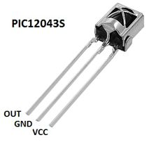
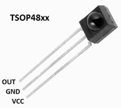
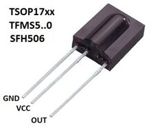
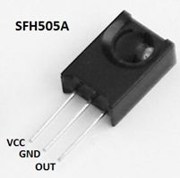
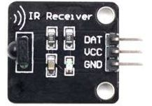

# IRsmallDecoder
 
## A small, fast and reliable infrared signals decoder to control Arduino projects with remotes.
This is a Library for receiving and decoding IR signals from remote controls. Perfect for your Arduino projects that need a fast, simple and reliable decoder, but don't require the usage of multiple different protocols at the same time and don't need to send IR signals.


## Table of Contents
* [Main features](#main-features)
* [Supported Protocols](#supported-protocols)
* [Supported Boards](#supported-boards)
* [Connecting the IR sensor](#connecting-the-ir-sensor)
* [Installing the the library](#installing-the-the-library)
* [Using the library](#using-the-library)
* [Possible improvements](#possible-improvements)
* [Contributions](#contributions)
* [Contact information](#contact-information)
* [License](#license)
* [Appendix A - Details about this library](#appendix-a---details-about-this-library)
* [Appendix B - IR sensor connection details](#appendix-b---ir-sensor-connection-details)


## Main features
* It fully decodes the signals and separates the data;
* It ignores unwanted initial repetition codes;
* It offers an easier way to handle held keys;
* Very loose signal tolerances;
* It uses error detection (when possible);
* Low SRAM and Flash memory usage;
* The decoding is done asynchronously, no timers required, so you can use them for other things;
* No conflicts with timer-related functionalities such as tone(), servos, analogWrite(), etc.;
* It uses one hardware (external) interrupt;
* No hardware specific instructions are used.


## Supported Protocols
* NEC
* NECx
* Philips RC5 and RC5x (simultaneously)
* Sony SIRC 12, 15 and 20 bits (individually or simultaneously)
* SAMSUNG old standard
* SAMSUNG 32 bits (16 of which are for error detection)


## Supported Boards 
Because no hardware specific instructions are used, it probably works on all Arduino boards (and possibly others, I'm not quite sure, I've only tested it thoroughly on an Arduino Uno and a Mega).

ATtiny 25/45/85/24/44/84 microcontrollers are supported.

If you have problems with this library on some board, please submit an issue here: https://github.com/LuisMiCa/IRSmallDecoder/issues  or [contact me](#contact-information).


## Connecting the IR sensor
The sensor's output must be connected to one of the Arduino's digital pin that is usable for interrupts and, also, it must work with the CHANGE mode if the intended protocol uses this mode. (One example of a board that does not have CHANGE mode on some of the interrupt pins is the Arduino 101; and one protocol that uses that mode is the [RC5](#speed)).

| Board or microcontroller            | Usable digital pins numbers    |
|-------------------------------------|--------------------------------|
| Uno, Nano, Mini, other 328-based    | 2, 3                           |
| Uno WiFi Rev.2                      | all digital pins               |
| Mega, Mega2560, MegaADK             | 2, 3, 18, 19, 20, 21           |
| Micro, Leonardo, other 32u4-based   | 0, 1, 2, 3, 7                  |
| Zero                                | all digital pins, except 4     |
| MKR Family boards                   | 0, 1, 4, 5, 6, 7, 8, 9, A1, A2 |
| Due                                 | all digital pins               |
| 101 with CHANGE mode                | 2, 5, 7, 8, 10, 11, 12, 13     |
| 101 with other modes                | all digital pins               |
| ATtiny 25/45/85                     | 2<sup>*</sup>                  |
| ATtiny 24/44/84                     | 8<sup>*</sup>                  |

<sup>[*] - Assuming you're using _damellis' ATtiny core_ (high-low tech) or _SpenceKonde's ATtinyCore_. (Other cores may have different pin assignments). </sup>

<sup>(Sources: <https://www.arduino.cc/reference/en/language/functions/external-interrupts/attachinterrupt/>; <http://highlowtech.org/?p=1695> and <https://github.com/SpenceKonde/ATTinyCore>)</sup>

If you're not sure about how to connect the IR Sensor to the Arduino, go to: [IR sensor connection details](#appendix-b---ir-sensor-connection-details) at the end of this document.


## Installing the the library
**With the Library Manager**
- Run Arduino IDE and go to _tools > Manage Libraries..._   
or _Sketch > Include Library > Manage Libraries..._;
- Search for IRsmallDecoder and install.

**Manually**
- Navigate to the [Releases page](https://github.com/LuisMiCa/IRsmallDecoder/releases);
- Download the latest release (zip file);
- Run Arduino IDE and go to _Sketch > Include Library > Add .ZIP Library_;
- Or, instead of using Arduino IDE, extract the zip file and move the extracted folder to your libraries directory.


## Using the library
In the INO file, **one** of the following directives must be used:
```ino
#define IR_SMALLD_NEC
#define IR_SMALLD_NECx
#define IR_SMALLD_RC5
#define IR_SMALLD_SIRC12
#define IR_SMALLD_SIRC15
#define IR_SMALLD_SIRC20
#define IR_SMALLD_SIRC
#define IR_SMALLD_SAMSUNG
#define IR_SMALLD_SAMSUNG32
```  

before the
```ino
#include <IRsmallDecoder.h>
```

Then you need to create **one** decoder object with the correct interrupt pin:
```ino
IRsmallDecoder irDecoder(2); //IR sensor connected to pin 2 in this example
```

And also a decoder data structure:
```ino
irSmallD_t irData;
```

Inside the loop(), check if the decoder has new data available. If so, do something with it:
```ino
void loop() {
  if(irDecoder.dataAvailable(irData)) {
    Serial.println(irData.cmd, HEX);
  }
}
```


### A full example
```ino
#define IR_SMALLD_NEC
#include <IRsmallDecoder.h>
IRsmallDecoder irDecoder(2);
irSmallD_t irData;
 
void setup() {
  Serial.begin(250000);
  Serial.println("Waiting for a NEC remote control IR signal...");
  Serial.println("held \t addr \t cmd");
}

void loop() {
  if(irDecoder.dataAvailable(irData)) {      
    Serial.print(irData.keyHeld,HEX);
    Serial.print("\t ");
    Serial.print(irData.addr,HEX); 
    Serial.print("\t ");
    Serial.println(irData.cmd,HEX);  
  }
}

```


### Protocol data structures
The protocol data structure is not the same for all protocols, but they all have two things in common:
- **cmd** - the button command code (one byte);
- **addr** - the address code (usually the same for most of the buttons on one single remote).

Most of the decoders have the **keyHeld** variable, which is set to _true_ when a button is being held.  
The SIRC protocol has the **ext** variable which holds extended data.

The following table shows the number of bits used by each protocol and the datatypes of the data structure member variables:

| Protocol  | keyHeld |     cmd    |    addr     |    ext     |
|-----------|:-------:|:----------:|:-----------:|:----------:|
| NEC       |   bool  |  8/uint8_t |  8/uint8_t  |     --     |
| NECx      |   bool  |  8/uint8_t | 16/uint16_t |     --     |
| RC5       |   bool  |  7/uint8_t |  5/uint8_t  |     --     |
| SIRC12    |   --    |  7/uint8_t |  5/uint8_t  |     --     |
| SIRC15    |   --    |  7/uint8_t |  8/uint8_t  |     --     |
| SIRC20    |   --    |  7/uint8_t |  5/uint8_t  |  8/uint8_t |
| SIRC      |   bool  |  7/uint8_t |  8/uint8_t  |  8/uint8_t |
| SAMSUNG   |   bool  |  8/uint8_t | 12/uint16_t |     --     |
| SAMSUNG32 |   bool  |  8/uint8_t |  8/uint8_t  |     --     |


### Notes
- Only one protocol can be compiled at a time, however:   
  - NECx also decodes NEC, but without the address error check;
  - The RC5 implementation also decodes the extended protocol version, which as a field bit that is used as an extra command bit (making a total of 7 bits);
  - SIRC handles 12, 15 and 20 bits at the same time, by taking advantage of the fact that most Sony remotes send three signal frames each time one button is pressed. It uses triple frame verification, checks if a key was held and adds a delay to prevent unwanted keyHeld codes;
  - SIRC12, SIRC15 and SIRC20 use a basic (smaller and faster) implementation, without the triple frame verification and without the keyHeld check;
    
- If there is some data available, when ```irDecoder.dataAvailable(irData)``` is called: that data is copied to the selected data structure; it marks the received data as unavailable and then returns true.

- If a new signal is received before the available data is retrieved, that previous data is discarded. This may happen if the loop takes to long to recheck if there's new data available, especially if delays are used. (They do not interfere with the decoding but I wouldn't recommended their use).


## Possible improvements
- More protocols! That's obvious;
- Support for more "non-standard" boards;
- The keyHeld initial delay is hard-coded, I could make it configurable (in constructor) or even changeable (with method);
- I could add methods to disable/re-enable the decoder, to temporarily allow the usage of other time critical interruptions (or to simply disable it when not needed);
- The _dataAvailable(irData)_ method could be overloaded with a version without irData;
- For now, it's not easy for anyone to add other protocols;
- I believe it may be possible to increase the number of usable pins, by using NicoHood's PinChangeInterrupt Library.
- SIRC12, SIRC15 and SIRC20 do not have the keyHeld feature. SIRC fills that gap but requires 3 frames for each keypress.


## Contributions
The first release was made without any contribution from other developers, but I do have to say that this work was inspired by some of the existing IR Arduino Libraries: 
[Arduino-IRremote](https://github.com/z3t0/Arduino-IRremote), 
[IRLib2](https://github.com/cyborg5/IRLib2), 
[IRReadOnlyRemote](https://github.com/otryti/IRReadOnlyRemote), 
[Infrared4Arduino](https://github.com/bengtmartensson/Infrared4Arduino), 
and especially the [IRLremote](https://github.com/NicoHood/IRLremote), which was almost what I was looking for, but not quite... so I decided to make my own NEC decoder and then an RC5 and a SIRC, practically from scratch. Finally I decided to put these decoders in a library, hoping that it will be useful to someone.
Possible future contributions will be mentioned here if they are significant. 


## Contact information
If you wish to report an issue related to this library (and don't want to do it on GitHub) you may send an e-mail to: <lumica@outlook.com>. Suggestions and comments are also welcome.


## License
Copyright (c) 2020 Luis Carvalho  
This library is licensed under the MIT license.  
See the LICENSE file for details.


---
<div style="page-break-after: always;"></div>

## Appendix A - Details about this library

### Size
The size of this library is, as the name implies, small (about 900 bytes on average, for the Arduino UNO board) and the memory usage is also reduced (around 30 bytes). Keep in mind that these values vary depending on the selected protocol and the board used.

**Program memory and static data used (in SRAM) on an Arduino UNO (in bytes):**

| Protocol  | Program memory | Static data |
|-----------|:--------------:|:-----------:|
| NEC       |      858       |     28      |
| NECx      |      854       |     30      |
| RC5       |     1062       |     31      |
| SIRC12    |      706       |     22      |
| SIRC15    |      682       |     22      |
| SIRC20    |      764       |     26      |
| SIRC      |     1262       |     37      |
| SAMSUNG   |      880       |     29      |
| SAMSUNG32 |      852       |     29      |

To keep track of the sizes of this library, I used the ToggleLED example as a reference to determine the actual sizes, by compiling a version without the IRsmallDecoder and comparing it to the full version, for each of the supported protocols.  
<div style="page-break-after: always;"></div>
<table>
<thead>
<tr>
<th>Reference sketch</th>
<th>ToggleLED sketch with NEC</th>
</tr>
</thead>
<tbody>
<tr>
<td>

```c++
// #define IR_SMALLD_NEC
// #include <IRsmallDecoder.h>
// IRsmallDecoder irDecoder(2); 
// irSmallD_t irData;
int ledState=LOW; 
void setup() {
  pinMode(LED_BUILTIN, OUTPUT);
}
void loop() {
//if(irDecoder.dataAvailable(irData)){
    ledState=(ledState==LOW)? HIGH:LOW;
    digitalWrite(LED_BUILTIN,ledState);
//}
}

// On Arduino UNO,
// Sketch uses 766 bytes
// Global variables use 11 bytes
```
</td>
<td>

```c++
#define IR_SMALLD_NEC
#include <IRsmallDecoder.h>
IRsmallDecoder irDecoder(2);
irSmallD_t irData;
int ledState=LOW; 
void setup() {
  pinMode(LED_BUILTIN, OUTPUT);
}
void loop() {
  if(irDecoder.dataAvailable(irData)){
    ledState=(ledState==LOW)? HIGH:LOW;
    digitalWrite(LED_BUILTIN,ledState);
  }
}

// On Arduino UNO, with NEC protocol,
// Sketch uses 1624 bytes
// Global variables use 39 bytes
```
</td>
</tr>
</tbody>
</table>


### Speed
Despite the fact that my main goals were functionality and small size, I believe this library is reasonably fast. I haven't compared it to other libraries, (its not easy to do so) but I did manage to compare the speed of the different protocols I've implemented so far:

<u>**Protocol Speed comparisons:**</u>

<table>
<thead>
	<tr>
		<th>Protocol</th>
		<th>Interrupt Mode</th>
		<th>Avg. Interrupt Time</th>
		<th>Max. Interrupt Time</th>
		<th>Interrupts per Keypress</th>
		<th>&nbsp;&nbsp;Signal&nbsp;Duration&nbsp;&nbsp;</th>
	</tr>
</thead>
<tbody>
	<tr>
		<td>NEC</td>
		<td>FALLING</td>
		<td>11.9 &#181;s</td>
		<td>14 &#181;s</td>
		<td>34</td>
		<td>67.5ms</td>
	</tr>
	<tr>
		<td>NECx</td>
		<td>FALLING</td>
		<td>11.4 &#181;s</td>
		<td>14 &#181;s</td>
		<td>34</td>
		<td>67.5ms</td>
	</tr>
	<tr>
		<td>RC5</td>
		<td>CHANGE</td>
		<td>10.4 &#181;s</td>
		<td>17 &#181;s</td>
		<td>14 to 28</td>
		<td>24.9ms</td>
	</tr>
	<tr>
		<td>SIRC12</td>
		<td>RISING</td>
		<td>11.0 &#181;s</td>
		<td>13 &#181;s</td>
		<td>3*13</td>
		<td>3*(17.4 to 24.6)ms</td>
	</tr>
	<tr>
		<td>SIRC15</td>
		<td>RISING</td>
		<td>10.9 &#181;s</td>
		<td>12 &#181;s</td>
		<td>3*16</td>
		<td>3*(21 to 30)ms</td>
	</tr>
	<tr>
		<td>SIRC20</td>
		<td>RISING</td>
		<td>11.1 &#181;s</td>
		<td>15 &#181;s</td>
		<td>3*21</td>
		<td>3*(27 to 39)ms</td>
	</tr>
	<tr>
		<td>SIRC</td>
		<td>RISING</td>
		<td>11.7 &#181;s</td>
		<td>17 &#181;s</td>
		<td>39, 48 or 63</td>
		<td>3*(17.4 to 39)ms</td>
	</tr>
	<tr>
		<td>SAMSUNG</td>
		<td>FALLING</td>
		<td>11.0 &#181;s</td>
		<td>13 &#181;s</td>
		<td>2*22</td>
		<td>2*(32.1 to 54.6)ms</td>
	</tr>
	<tr>
		<td>SAMSUNG32</td>
		<td>FALLING</td>
		<td>11.0 &#181;s</td>
		<td>14 &#181;s</td>
		<td>34</td>
		<td>54.6 to 72.6</td>
	</tr>
</tbody>
</table>


Notes:
- Signal Duration is the effective signal duration, not the signal period.
- Tested on an Arduino Uno @ 16MHz;
- To get the number of the clock cycles used by an interruption, multiply the time (in μs) by 16;
- The decoding is partially done while the signal is being received. When one signal is fully received, the final stage of the decoding is executed and that's when the interruption takes more time to run.


### Asynchronous?
The decoding is done asynchronously, meaning it does not rely on a timer to receive and process the signals. but it still uses a hardware interrupt to drive the Finite State Machines that perform the decoding. Actually, they are Statechart Machines (David Harel type) working in asynchronous mode.

Most of the protocols' Statechart Machines are implemented using _switch cases_, but I also use the "labels as values" GCC extension (AKA "computed gotos") to implement some of the more complex machines. It's not a C++ standard but it should work with all IDEs that use the GCC (like Arduino IDE). 

If you have problems compiling any of the protocols that use the "labels as values" extension, please submit an issue here: <https://github.com/LuisMiCa/IRsmallDecoder/issues>  or [contact me](#contact-information).


### Unwanted initial repetition codes
Remote control keys do not "bounce", but the remotes do tend to send more codes than we wish for, when we press a button. That's because, after a very short interval, they start to send repeat codes. To avoid those unwanted initial repetitions, this library ignores a few of those repetition codes before confirming that the button is really being held.


### Data separation
The data sent by the remotes is decoded according to the protocols' specifications and separated into different variables. In most remotes only the 8 bit command matters, so you don't have to work with 16 or 32 bit codes, reducing code size and memory usage.


### Simplicity
As you've probably seen above, or if you've tried out any of the "Hello..." examples, this library is very simple to use and it's not full of rarely needed features. That's what makes it small and why it uses very few resources. Additional features may be included in the future, but only if they are requested and do not affect the size and/or speed significantly. 


### How it works
I can't say that it's simple to understand how the decoders work, some of the Statechart Machines I've designed turned out to be a bit convoluted. But if you still would like to take a look at the statechart diagrams, they can be found here <https://github.com/LuisMiCa/IRsmallDecoder/tree/master/extras/Statecharts>. Please note that they may not be an exact representation of what I've effectively implemented, but they are a good starting point. 


### No hardware specific instructions
In order to make this library compatible with most of the Arduino boards, I didn't include any hardware specific instructions, but I did use a programming technique in which it's assumed that the microcontroller's endianness is Little-Endian. On some boards you may even get a warning related to this, but it should work anyway. 


---
<div style="page-break-after: always;"></div>

## Appendix B - IR sensor connection details

If you are using a simple IR Receiver module the pinout order will be, most likely, `Vout Gnd Vcc` like in the the following examples:

|  |  |
|-------------------------------------|------------------------------------|

But beware, there are other IR Receivers with different pinouts, like these examples:

|  |  |
|------------------------------------|-----------------------------------|
 
<table> 
    <tbody> <tr>
    	<td> If you are using a test  <br />
    	     module, the pinout is usually <br />
    	     written on it (sometimes it's <br />
    	     DAT or S instead of Vout).
    	</td>
    	<td> </img> </td>
    </tr> </tbody> 
</table>


The connection to the Arduino is very straightforward, just connect:
- OUT (or DAT or S) to one of the Arduino's digital pin that has interrupt capability<sup>[1]</sup>;
- VCC to the Arduino's +5V or (+3.3V if you are using a board with lower operating voltage<sup>[2]</sup>);
- GND to one of the Arduino's Ground connector.
 
    <sup>[1] Go to [Connecting the IR sensor](#connecting-the-ir-sensor) for more information.</sup>  
    <sup>[2] Note that not all IR Sensors can operate at low voltages.</sup> 
 
Nearly all IR Sensor's datashets recommend the usage of an RC filter (R1, C1) at the power input, but it's not really necessary, (it's meant to suppress power supply disturbances):


Note that most IR Receiver Test Modules already have that RC filter.


