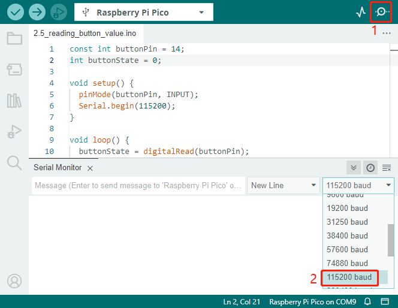

.. note::

    Hello, welcome to the SunFounder Raspberry Pi & Arduino & ESP32 Enthusiasts Community on Facebook! Dive deeper into Raspberry Pi, Arduino, and ESP32 with fellow enthusiasts.

    **Why Join?**

    - **Expert Support**: Solve post-sale issues and technical challenges with help from our community and team.
    - **Learn & Share**: Exchange tips and tutorials to enhance your skills.
    - **Exclusive Previews**: Get early access to new product announcements and sneak peeks.
    - **Special Discounts**: Enjoy exclusive discounts on our newest products.
    - **Festive Promotions and Giveaways**: Take part in giveaways and holiday promotions.

    👉 Ready to explore and create with us? Click [|link_sf_facebook|] and join today!

.. _ar_button:

2.5 - Reading Button Value
==============================================

From the name of GPIO (General-purpose input/output), we can see that these pins have both input and output functions. 
In the previous lessons, we used the output function, in this chapter we will use the input function to input read the button value.

* :ref:`cpn_button`

**Required Components**

In this project, we need the following components. 

It's definitely convenient to buy a whole kit, here's the link: 

.. list-table::
    :widths: 20 20 20
    :header-rows: 1

    *   - Name	
        - ITEMS IN THIS KIT
        - PURCHASE LINK
    *   - Kepler Kit	
        - 450+
        - |link_kepler_kit|

You can also buy them separately from the links below.

.. list-table::
    :widths: 5 20 5 20
    :header-rows: 1

    *   - SN
        - COMPONENT INTRODUCTION	
        - QUANTITY
        - PURCHASE LINK

    *   - 1
        - :ref:`cpn_pico_w`
        - 1
        - |link_picow_buy|
    *   - 2
        - Micro USB Cable
        - 1
        - 
    *   - 3
        - :ref:`cpn_breadboard`
        - 1
        - |link_breadboard_buy|
    *   - 4
        - :ref:`cpn_wire`
        - Several
        - |link_wires_buy|
    *   - 5
        - :ref:`cpn_resistor`
        - 1(10KΩ)
        - |link_resistor_buy|
    *   - 6
        - :ref:`cpn_button`
        - 1
        - |link_button_buy|

**Schematic**

|sch_button|

One side of the button pin is connected to 3.3v, and the other side pin is connected to GP14, so when the button is pressed, GP14 will be high. However, when the button is not pressed, GP14 is in a suspended state and may be high or low. In order to get a stable low level when the button is not pressed, GP14 needs to be reconnected to GND through a 10K pull-down resistor.

**Wiring**

|wiring_button|

.. note::
    We can think of the four-legged button as an H-shaped button. Its left (right) two feet are connected, which means that after it straddles the central dividing line, it will connect the two half rows of the same row number together. (For example, in my circuit, E23 and F23 have been connected, as are E25 and F25).

    Before the button is pressed, the left and right sides are independent of each other, and current cannot flow from one side to the other.

**Code**

.. note::

   * You can open the file ``2.5_reading_button_value.ino`` under the path of ``kepler-kit-main/arduino/2.5_reading_button_value``. 
   * Or copy this code into **Arduino IDE**.

    * Don't forget to select the board(Raspberry Pi Pico) and the correct port before clicking the **Upload** button.

.. raw:: html
    
    <iframe src=https://create.arduino.cc/editor/sunfounder01/6fcb7cac-e866-4a2d-8162-8e0c6fd17660/preview?embed style="height:510px;width:100%;margin:10px 0" frameborder=0></iframe>

After the code runs, Click the magnifying glass icon in the upper right corner of the Arduino IDE (Serial Monitor).

Now, when you press the button, the Serial Monitor will print "You pressed the button!".

**How it works?**

To enable Serial Monitor, you need to start serial communication in ``setup()`` and set the datarate to 9600.

.. code-block:: arduino

    Serial.begin(115200);

    
* `Serial <https://www.arduino.cc/reference/en/language/functions/communication/serial/>`_

For button, we need to set their mode to ``INPUT`` in order to be able to get their values.

.. code-block:: arduino

    pinMode(buttonPin, INPUT);

Read the status of the ``buttonPin`` in ``loop()`` and assign it to the variable ``buttonState``.

.. code-block:: arduino

    buttonState = digitalRead(buttonPin);
    
* `digitalRead() <https://www.arduino.cc/reference/en/language/functions/digital-io/digitalread/>`_

If the ``buttonState`` is HIGH, the LED will flash. 
print "You pressed the button!" on the Serial monitor.

.. code-block:: arduino

    if (buttonState == HIGH) {
        Serial.println("You pressed the button!");
    }

**Pull-up Working Mode**

Next is the wiring and code when the button in the pull-up working mode, please try it.

|wiring_button_pullup|

.. 1. Connect the 3V3 pin of Pico W to the positive power bus of the breadboard.
.. #. Insert the button into the breadboard and straddle the central dividing line.
.. #. Use a jumper wire to connect one of the button pins to the **negative** bus (mine is the pin on the upper right).
.. #. Connect the other pin (upper left or lower left) to GP14 with a jumper wire.
.. #. Use a 10K resistor to connect the pin on the upper left corner of the button and the **positive** bus.
.. #. Connect the negative power bus of the breadboard to Pico's GND.

The only difference you will see with the pull-down mode is that the 10K resistor is connected to 3.3V and the button is connected to GND, so that when the button is pressed, GP14 will get a low level, which is the opposite of the value obtained in pull-down mode.
So just change this code to ``if (buttonState == LOW)``.
