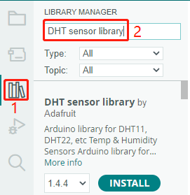
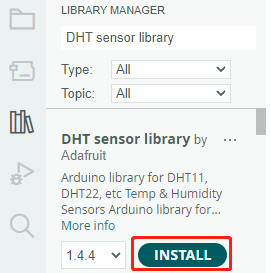

.. note::

    Hallo und willkommen in der SunFounder Raspberry Pi & Arduino & ESP32 Enthusiasten-Gemeinschaft auf Facebook! Tauchen Sie tiefer ein in die Welt von Raspberry Pi, Arduino und ESP32 mit anderen Enthusiasten.

    **Warum beitreten?**

    - **Expertenunterstützung**: Lösen Sie Nachverkaufsprobleme und technische Herausforderungen mit Hilfe unserer Gemeinschaft und unseres Teams.
    - **Lernen & Teilen**: Tauschen Sie Tipps und Anleitungen aus, um Ihre Fähigkeiten zu verbessern.
    - **Exklusive Vorschauen**: Erhalten Sie frühzeitigen Zugang zu neuen Produktankündigungen und exklusiven Einblicken.
    - **Spezialrabatte**: Genießen Sie exklusive Rabatte auf unsere neuesten Produkte.
    - **Festliche Aktionen und Gewinnspiele**: Nehmen Sie an Gewinnspielen und Feiertagsaktionen teil.

    👉 Sind Sie bereit, mit uns zu erkunden und zu erschaffen? Klicken Sie auf [|link_sf_facebook|] und treten Sie heute bei!

1.4 Bibliotheken installieren (Wichtig)
===========================================

Viele Bibliotheken sind direkt über den Arduino **Bibliotheksmanager** verfügbar. Sie können auf den **Bibliotheksmanager** zugreifen, indem Sie die folgenden Schritte ausführen:

Im **Bibliotheksmanager** können Sie nach der gewünschten Bibliothek suchen oder durch verschiedene Kategorien blättern.

.. Hinweis::

   In Projekten, bei denen die Installation von Bibliotheken erforderlich ist, werden Hinweise angezeigt, welche Bibliotheken installiert werden müssen. Befolgen Sie die bereitgestellten Anweisungen, wie zum Beispiel „Die DHT-Sensorbibliothek wird hier verwendet, Sie können sie über den **Bibliotheksmanager** installieren.“ Installieren Sie einfach die empfohlenen Bibliotheken wie angegeben.

Sobald Sie die Bibliothek gefunden haben, die Sie installieren möchten, klicken Sie darauf und dann auf die Schaltfläche **INSTALLIEREN**.

Die Arduino IDE lädt die Bibliothek automatisch herunter und installiert sie für Sie.

.. Hinweis::

   Die installierten Bibliotheken befinden sich im Standard-Bibliotheksverzeichnis der Arduino IDE, das sich normalerweise unter ``C:\Users\xxx\Documents\Arduino\libraries`` befindet.

   Wenn Ihr Bibliotheksverzeichnis anders ist, können Sie dies überprüfen, indem Sie zu **Datei** -> **Voreinstellungen** gehen.

      .. image:: img/install_lib1.png
