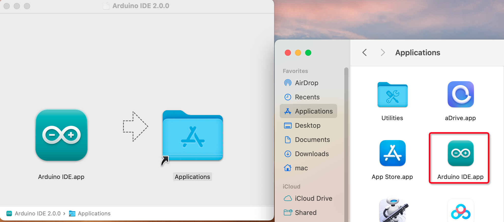

.. note::

    Hello, welcome to the SunFounder Raspberry Pi & Arduino & ESP32 Enthusiasts Community on Facebook! Dive deeper into Raspberry Pi, Arduino, and ESP32 with fellow enthusiasts.

    **Why Join?**

    - **Expert Support**: Solve post-sale issues and technical challenges with help from our community and team.
    - **Learn & Share**: Exchange tips and tutorials to enhance your skills.
    - **Exclusive Previews**: Get early access to new product announcements and sneak peeks.
    - **Special Discounts**: Enjoy exclusive discounts on our newest products.
    - **Festive Promotions and Giveaways**: Take part in giveaways and holiday promotions.

    👉 Ready to explore and create with us? Click [|link_sf_facebook|] and join today!

.. _install_arduino:

1.1 Install Arduino IDE(Important)
======================================

The Arduino IDE, known as Arduino Integrated Development Environment, provides all the software support needed to complete an Arduino project. It is a programming software specifically designed for Arduino, provided by the Arduino team, that allows us to write programs and upload them to the Arduino board. 

The Arduino IDE 2.0 is an open-source project. It is a big step from its sturdy predecessor, Arduino IDE 1.x, and comes with revamped UI, improved board & library manager, debugger, autocomplete feature and much more.

In this tutorial, we will show how to download and install the Arduino IDE 2.0 on your Windows, Mac, or Linux computer.

Requirements
-------------------

* Windows - Win 10 and newer, 64 bits
* Linux - 64 bits
* Mac OS X - Version 10.14: "Mojave" or newer, 64 bits

Download the Arduino IDE 2.0
-------------------------------

#. Visit |link_download_arduino| page.

#. Download the IDE for your OS version.

    .. image:: img/sp_001.png

Installation
------------------------------

Windows
^^^^^^^^^^^^^

#. Double click the ``arduino-ide_xxxx.exe`` file to run the downloaded file.

#. Read the License Agreement and agree it.

    .. image:: img/sp_002.png

#. Choose installation options.

    .. image:: img/sp_003.png

#. Choose install location. It is recommended that the software be installed on a drive other than the system drive.

    .. image:: img/sp_004.png

#. Then Finish. 

    .. image:: img/sp_005.png

macOS
^^^^^^^^^^^^^^^^

Double click on the downloaded ``arduino_ide_xxxx.dmg`` file and follow the instructions to copy the **Arduino IDE.app** to the **Applications** folder, you will see the Arduino IDE installed successfully after a few seconds.

Linux
^^^^^^^^^^^^

For the tutorial on installing the Arduino IDE 2.0 on a Linux system, please refer to: https://docs.arduino.cc/software/ide-v2/tutorials/getting-started/ide-v2-downloading-and-installing#linux

Open the IDE
--------------

#. When you first open Arduino IDE 2.0, it automatically installs the Arduino AVR Boards, built-in libraries, and other required files.

    .. image:: img/sp_901.png

#. In addition, your firewall or security center may pop up a few times asking you if you want to install some device driver. Please install all of them.

    .. image:: img/sp_104.png

#. Now your Arduino IDE is ready!

    .. note::
        In the event that some installations didn't work due to network issues or other reasons, you can reopen the Arduino IDE and it will finish the rest of the installation. The Output window will not automatically open after all installations are complete unless you click Verify or Upload.

