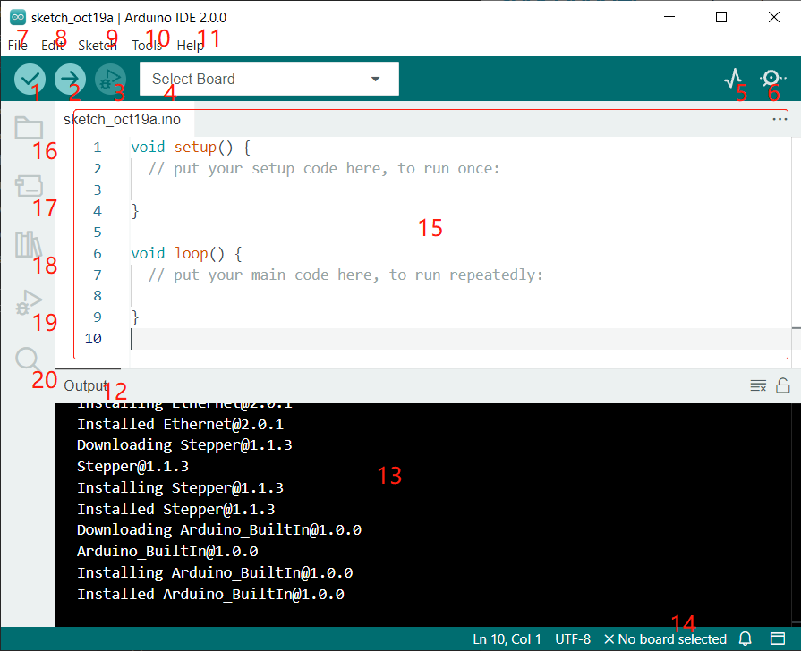

.. note::

    Ciao, benvenuto nella community di appassionati di SunFounder Raspberry Pi, Arduino e ESP32 su Facebook! Approfondisci Raspberry Pi, Arduino e ESP32 insieme ad altri appassionati.

    **Perché unirsi?**

    - **Supporto esperto**: Risolvi i problemi post-vendita e affronta le sfide tecniche con l'aiuto della nostra community e del nostro team.
    - **Impara e Condividi**: Scambia consigli e tutorial per migliorare le tue competenze.
    - **Anteprime Esclusive**: Accedi in anteprima agli annunci di nuovi prodotti e alle anteprime esclusive.
    - **Sconti Speciali**: Approfitta di sconti esclusivi sui nostri prodotti più recenti.
    - **Promozioni Festive e Giveaway**: Partecipa a giveaway e promozioni durante le festività.

    👉 Pronto a esplorare e creare con noi? Clicca su [|link_sf_facebook|] e unisciti oggi stesso!

1.2 Introduzione all'Arduino IDE
====================================

1. **Verifica**: Compila il tuo codice. Qualsiasi problema di sintassi verrà segnalato con errori.

2. **Carica**: Carica il codice sulla tua scheda. Quando clicchi il pulsante, i LED RX e TX sulla scheda lampeggeranno velocemente e non si fermeranno finché il caricamento non sarà completato.

3. **Debug**: Per il controllo degli errori riga per riga.

4. **Seleziona Scheda**: Configura rapidamente la scheda e la porta.

5. **Plotter Seriale**: Controlla la variazione dei valori letti.

6. **Monitor Seriale**: Clicca il pulsante e apparirà una finestra. Riceve i dati inviati dalla tua scheda di controllo. È molto utile per il debug.

7. **File**: Clicca sul menu e apparirà un elenco a discesa che include creazione, apertura, salvataggio, chiusura di file, configurazione di parametri, ecc.

8. **Modifica**: Clicca sul menu. Nell'elenco a discesa ci sono alcune operazioni di modifica come **Taglia**, **Copia**, **Incolla**, **Trova**, e così via, con le loro scorciatoie corrispondenti.

9. **Sketch**: Include operazioni come **Verifica**, **Carica**, **Aggiungi** file, ecc. Una funzione importante è **Include Library** - dove puoi aggiungere librerie.

10. **Strumenti**: Include alcuni strumenti - i più utilizzati sono Scheda (la scheda che usi) e Porta (la porta a cui è collegata la tua scheda). Ogni volta che vuoi caricare il codice, devi selezionarli o verificarli.

11. **Aiuto**: Se sei un principiante, puoi controllare le opzioni sotto il menu e ottenere l'aiuto di cui hai bisogno, comprese le operazioni nell'IDE, informazioni introduttive, risoluzione dei problemi, spiegazione del codice, ecc.

12. **Barra di Output**: Qui puoi cambiare la scheda di output.

13. **Finestra di Output**: Stampa informazioni.

14. **Scheda e Porta**: Qui puoi visualizzare la scheda e la porta selezionate per il caricamento del codice. Puoi selezionarli nuovamente tramite **Strumenti** -> **Scheda** / **Porta** se qualcosa non è corretto.

15. Area di modifica dell'IDE. Qui puoi scrivere il codice.

16. **Sketchbook**: Per gestire i file degli sketch.

17. **Gestore Schede**: Per gestire i driver della scheda.

18. **Gestore Librerie**: Per gestire i file della tua libreria.

19. **Debug**: Aiuta nel debug del codice.

20. **Cerca**: Cerca il codice nei tuoi sketch.
