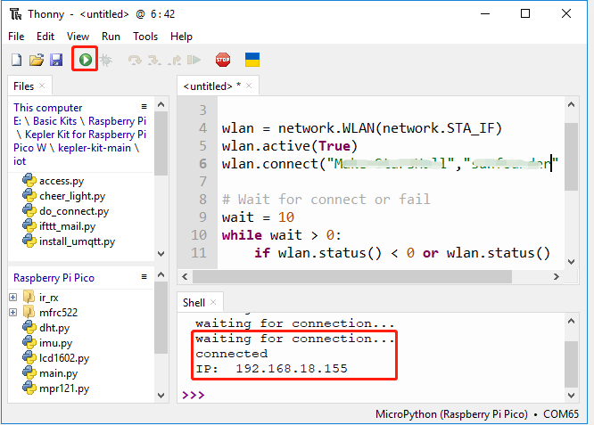

.. note::

    Hello, welcome to the SunFounder Raspberry Pi & Arduino & ESP32 Enthusiasts Community on Facebook! Dive deeper into Raspberry Pi, Arduino, and ESP32 with fellow enthusiasts.

    **Why Join?**

    - **Expert Support**: Solve post-sale issues and technical challenges with help from our community and team.
    - **Learn & Share**: Exchange tips and tutorials to enhance your skills.
    - **Exclusive Previews**: Get early access to new product announcements and sneak peeks.
    - **Special Discounts**: Enjoy exclusive discounts on our newest products.
    - **Festive Promotions and Giveaways**: Take part in giveaways and holiday promotions.

    👉 Ready to explore and create with us? Click [|link_sf_facebook|] and join today!

.. _iot_access:

1. Access to the Network
===========================

Raspberry Pi Pico W is very similar to Raspberry Pi Pico, with the same GPIO, microUSB port, and size. The only difference is the addition of the CYW43439 2.4-GHz Wi-Fi chip from Infineon.
Now let's see how it connects to our Wi-Fi network.

**Required Components**

In this project, we need the following components. 

It's definitely convenient to buy a whole kit, here's the link: 

.. list-table::
    :widths: 20 20 20
    :header-rows: 1

    *   - Name	
        - ITEMS IN THIS KIT
        - LINK
    *   - Kepler Kit	
        - 450+
        - |link_kepler_kit|

You can also buy them separately from the links below.

.. list-table::
    :widths: 5 20 5 20
    :header-rows: 1

    *   - SN
        - COMPONENT	
        - QUANTITY
        - LINK

    *   - 1
        - :ref:`cpn_pico_w`
        - 1
        - |link_picow_buy|
    *   - 2
        - Micro USB Cable
        - 1
        - 

1. Connect to the Internet
------------------------------------

With just five lines of MicroPython, our Raspberry Pi Pico W is happily connected to the Internet.

These 5 lines of code can be run directly from the Shell, pressing the ``Enter`` after you typing.
Or refer to the following method and create a new ``.py`` file to run it.

.. code-block:: python

    import network
    wlan = network.WLAN(network.STA_IF)
    wlan.active(True)
    wlan.connect("SSID","PASSWORD")
    print(wlan.isconnected())

#. Create a new script by clicking the **New** button on Thonny, and copy and paste the above code, changing the ``SSID`` and ``PASSWORD`` to your own.

    .. image:: img/access1.png

#. To run the script, click the **Run current script** button or press F5. If the connection is successful, ``true`` will be printed. 

    .. note::

        Make sure the Raspberry Pi Pico W is connected to computer via a USB cable, then click on the bottom right corner to select MicroPython (Raspberry Pi Pico).COMXxx as the interpreter.

    .. image:: img/access2.png

2. Timeout Judgment and Show IP
-----------------------------------------------

Considering some poor network conditions, let's add some timeout judgment to the code.

If the connection is successful, the IP of Pico W will be displayed after copying and running the script.

.. code-block:: python

    import network
    import time

    wlan = network.WLAN(network.STA_IF)
    wlan.active(True)
    wlan.connect("SSID","PASSWORD")

    # Wait for connect or fail
    wait = 10
    while wait > 0:
        if wlan.status() < 0 or wlan.status() >= 3:
            break
        wait -= 1
        print('waiting for connection...')
        time.sleep(1)

    # Handle connection error
    if wlan.status() != 3:
        raise RuntimeError('wifi connection failed')
    else:
        print('connected')
        print('IP: ', wlan.ifconfig()[0])

* ``wlan.status()`` function: Returns the current status of the wireless connection, the return value is shown in the table below.

    .. list-table::
        :widths: 40 10 50

        * - Status
          - Value
          - Description
        * - STAT_IDLE 
          - 0 
          - no connection and no activity,
        * - STAT_CONNECTING 
          - 1 
          - connecting in progress,
        * - STAT_WRONG_PASSWORD 
          - -3 
          - failed due to incorrect password,
        * - STAT_NO_AP_FOUND 
          - -2 
          - failed because no access point replied,
        * - STAT_CONNECT_FAIL 
          - -1 
          - failed due to other problems,
        * - STAT_GOT_IP 
          - 3 
          - connection successful.

* ``wlan.ifconfig()`` function: Obtains IP addresses, subnet masks, gateways, and DNS servers. This method will return a 4-tuple containing the above information when called directly. In this case, we only print the IP address.

*  `class WLAN – MicroPython Docs <https://docs.micropython.org/en/latest/library/network.WLAN.html>`_

.. _create_secrets:

3. Save private information to ``secrets.py``
----------------------------------------------------------

When you share your Pico W project, you should not want others to see your Wi-Fi password or API key.
For good security, we can create a ``secrets.py`` file to store your private information.

#. Copy the following code into a new script file on Thonny. Note to change ``SSID`` and ``PASSWORD`` to yours.

    .. code-block:: python

        secrets = {
        'ssid': 'SSID',
        'password': 'PASSWORD',
        }

#. Choose Raspberry Pi Pico in the pop-up window that appears when you click the Save button or press ``Ctrl+S``.

    .. image:: img/access4.png

#. Set the name to ``secrets.py``.

    .. image:: img/access5.png

#. Now you can see this script in your Raspberry Pi Pico W.

    .. image:: img/access6.png

#. In other scripts, you can call it as follows. If you run it, you will see a successful Wi-Fi connection. The ``secrets.py`` file is imported as a library, so we need not worry about leakage of information.

    .. code-block:: python
        :emphasize-lines: 3,7

        import network
        import time
        from secrets import secrets

        wlan = network.WLAN(network.STA_IF)
        wlan.active(True)
        wlan.connect(secrets['ssid'], secrets['password'])

        # Wait for connect or fail
        wait = 10
        while wait > 0:
            if wlan.status() < 0 or wlan.status() >= 3:
                break
            wait -= 1
            print('waiting for connection...')
            time.sleep(1)

        # Handle connection error
        if wlan.status() != 3:
            raise RuntimeError('wifi connection failed')
        else:
            print('connected')
            print('IP: ', wlan.ifconfig()[0])

    .. image:: img/access8.png

.. _do_connect:

4. Connect to the Internet via ``do_connect.py``
--------------------------------------------------------------

Considering that each of our next projects will require a network connection, why don't we create a new ``do_connect.py`` file and write the relevant functions into it for reuse, which can greatly streamline the code of complex projects.

#. Copy the following code into a new script file, and save it to Raspberry Pi Pico as ``do_connect.py``.

    .. code-block:: python

        import network
        import time
        from secrets import *

        def do_connect(ssid=secrets['ssid'],psk=secrets['password']):
            wlan = network.WLAN(network.STA_IF)
            wlan.active(True)
            wlan.connect(ssid, psk)

            # Wait for connect or fail
            wait = 10
            while wait > 0:
                if wlan.status() < 0 or wlan.status() >= 3:
                    break
                wait -= 1
                print('waiting for connection...')
                time.sleep(1)

            # Handle connection error
            if wlan.status() != 3:
                raise RuntimeError('wifi connection failed')
            else:
                print('connected')
                ip=wlan.ifconfig()[0]
                print('network config: ', ip)
                return ip

    .. image:: img/access7.png

#. Calling it in other scripts by the following will allow the Raspberry Pi Pico W to connect to the network.

    .. code-block:: python

        from do_connect import *
        do_connect()

.. https://www.tomshardware.com/reviews/raspberry-pi-pico-w

