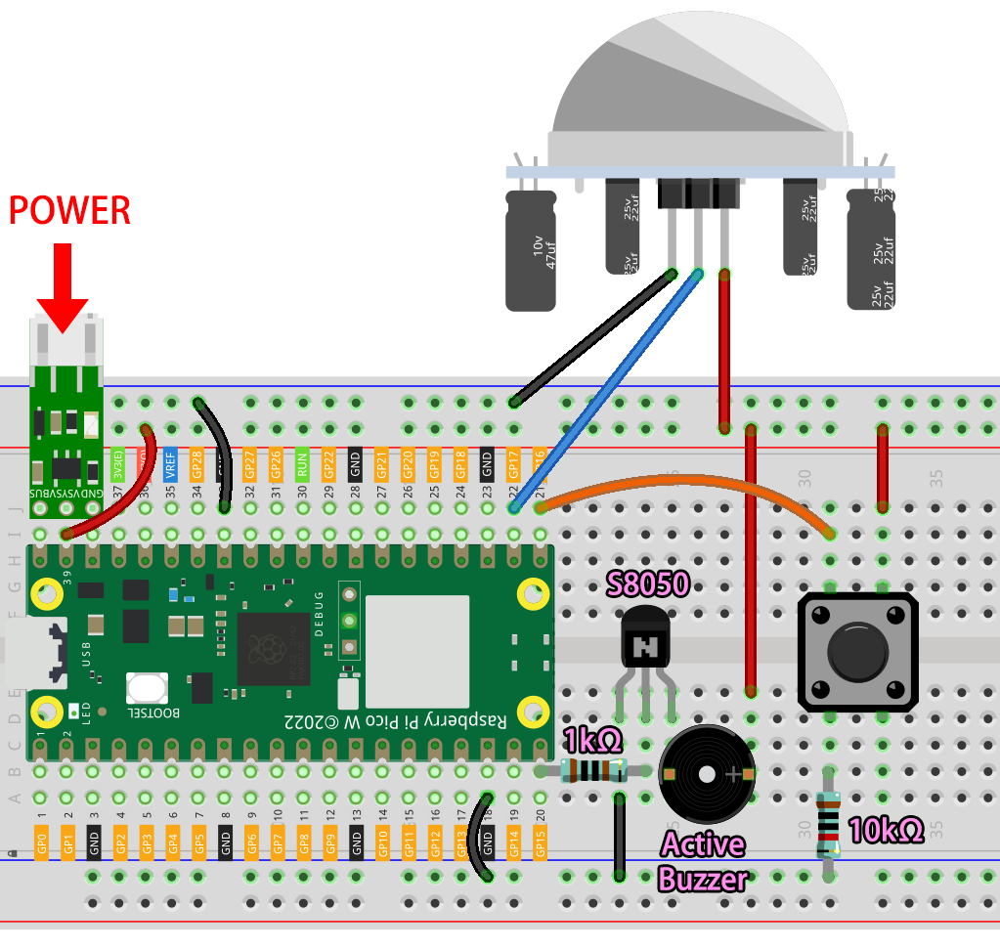

.. note::

    Hello, welcome to the SunFounder Raspberry Pi & Arduino & ESP32 Enthusiasts Community on Facebook! Dive deeper into Raspberry Pi, Arduino, and ESP32 with fellow enthusiasts.

    **Why Join?**

    - **Expert Support**: Solve post-sale issues and technical challenges with help from our community and team.
    - **Learn & Share**: Exchange tips and tutorials to enhance your skills.
    - **Exclusive Previews**: Get early access to new product announcements and sneak peeks.
    - **Special Discounts**: Enjoy exclusive discounts on our newest products.
    - **Festive Promotions and Giveaways**: Take part in giveaways and holiday promotions.

    👉 Ready to explore and create with us? Click [|link_sf_facebook|] and join today!

3. Security System via @IFTTT
============================================
With this project, we make a security device that uses a PIR Sensor to detect when a burglar or stray animal breaks into your home. You will receive an email alert if this is the case.

Webhook will be used as the most basic service.
A POST request is sent to IFTTT's service from Raspberry Pi Pico W.
Using IFTTT, we will create an Applet to intercept the webhook and send an email.

**1. Required Components**

In this project, we need the following components. 

It's definitely convenient to buy a whole kit, here's the link: 

.. list-table::
    :widths: 20 20 20
    :header-rows: 1

    *   - Name	
        - ITEMS IN THIS KIT
        - LINK
    *   - Kepler Kit	
        - 450+
        - |link_kepler_kit|

You can also buy them separately from the links below.

.. list-table::
    :widths: 5 20 5 20
    :header-rows: 1

    *   - SN
        - COMPONENT	
        - QUANTITY
        - LINK

    *   - 1
        - :ref:`cpn_pico_w`
        - 1
        - |link_picow_buy|
    *   - 2
        - Micro USB Cable
        - 1
        - 
    *   - 3
        - :ref:`cpn_breadboard`
        - 1
        - |link_breadboard_buy|
    *   - 4
        - :ref:`cpn_wire`
        - Several
        - |link_wires_buy|
    *   - 5
        - :ref:`cpn_transistor`
        - 1(S8050)
        - |link_transistor_buy|
    *   - 6
        - :ref:`cpn_resistor`
        - 2(1KΩ, 10KΩ)
        - |link_resistor_buy|
    *   - 7
        - :ref:`cpn_button`
        - 1
        - |link_button_buy|
    *   - 8
        - Active :ref:`cpn_buzzer`
        - 1
        - 
    *   - 9
        - :ref:`cpn_lipo_charger`
        - 1
        -  
    *   - 10
        - 18650 Battery
        - 1
        -  
    *   - 11
        - Battery Holder
        - 1
        -  
    *   - 12
        - :ref:`cpn_pir`
        - 1
        - |link_pir_buy|

**2. Build the Circuit**

.. warning:: 
        
    Make sure your Li-po Charger Module is connected as shown in the diagram. Otherwise, a short circuit will likely damage your battery and circuitry.

**3. SET IFTTT**

IFTTT is a free service that provides a variety of ways to connect different data services together.

We'll create an Applet that reacts to a webhook (custom URL) that sends data to IFTTT.
IFTTT will then send an email for you.

Please follow the steps below on IFTTT.

1. Visit |link_ifttt| to log in or create an account.

    .. image:: img/ifttt-1.png
        :width: 500

2. Click on **Create**.

    .. image:: img/ifttt-2.png
        :width: 500

3. Add an **If This** event.

    .. image:: img/ifttt-3.png
        :width: 500

4. Search for **Webhooks**.

    .. image:: img/ifttt-4.png
        :width: 500

5. Tap **Receive a web request**.

    .. image:: img/ifttt-5.png
        :width: 500

6. Fill in the event name (e.g. SecurityWarning), and click **Create trigger**.

    .. image:: img/ifttt-6.png
        :width: 500

7. Add a **Then That** event.

    .. image:: img/ifttt-7.png
        :width: 500

8. Search for Email.

    .. image:: img/ifttt-8.png
        :width: 500

9. Click **Send me an email**.

    .. image:: img/ifttt-9.png
        :width: 500

10. Fill in **Subject** and **Body**, then click on **Create action**.

    .. image:: img/ifttt-10.png
        :width: 500

11. Click **Continue** to complete the configuration.

    .. image:: img/ifttt-11.png
        :width: 500

12. Modify the title name and you're finished.

    .. image:: img/ifttt-12.png
        :width: 500

13. Now you will be automatically redirected to the Applet details page, where you can see that the Applet is currently connected and you can toggle the switch to start/close it.

    .. image:: img/ifttt-13.png
        :width: 500

**4. Run the Script**

#. Now that we have created the IFTTT Applet, but we also need the API Key which can be obtained from the |link_webhooks| to allow Pico W to access IFTTT.

    .. image:: img/ifttt-14.png
        :width: 500

#. Copy it to the ``secrets.py`` script in Raspberry Pi Pico W.

    .. image:: img/3_ifttt4.png

    .. note::

        If you don't have ``do_connect.py`` and ``secrets.py`` scripts in your Pico W, please refer to :ref:`iot_access` to create them.

    .. code-block:: python
        :emphasize-lines: 4

        secrets = {
        'ssid': 'SSID',
        'password': 'PASSWORD',
        'webhooks_key':'WEBHOOKS_API_KEY'
        }

#. Open the ``3_ifttt_mail.py`` file under the path of ``kepler-kit-main/iot``, then click **File** -> **Save as** or press ``Ctrl+Shift+S``.

    .. image:: img/3_ifttt1.png

#. Select **Raspberry Pi Pico** in the popup window that appears.

    .. image:: img/3_ifttt2.png

#. Set the file name to ``main.py``. A prompt will appear if the same file already exists on your Pico W.

    .. image:: img/3_ifttt3.png

#. You can now unplug the USB cable and use the Li-po Charger Module to power the Raspberry Pi Pico W. You will hear a buzzer tick when the script is running. The buzzer will keep sounding if the PIR module detects a person/creature passing by, and an email alert will be sent to you. The script can be restarted by pressing the button.

**How it works?**

The Raspberry Pi Pico W needs to be connected to the Internet, as described in :ref:`iot_access`. For this project, just use it.

.. code-block:: python

    from do_connect import *
    do_connect()

Reads data from the PIR module and calls the ``motion_detected()`` function if it detects someone passing by (data from 0 to 1).

.. code-block:: python

    import machine

    sensor=machine.Pin(17,machine.Pin.IN)

    sensor.irq(trigger=machine.Pin.IRQ_RISING, handler=motion_detected)

Next the Pico W sends data to IFTTT. As you can see, the ``message`` that you send to IFTTT is a url string.
IFTTT identifies the sender by ``secrets['webhooks_key']``, the triggered event is identified by ``event``.
So, make sure they are correct.

.. code-block:: python

    import urequests
    from secrets import *

    event='SecurityWarning'
    message=f"https://maker.ifttt.com/trigger/{event}/with/key/{secrets['webhooks_key']}"

    def motion_detected(pin):
        urequests.post(message)
        print(message)
        global warn_flag
        warn_flag=True
        sensor.irq(handler=None)

When ``motion_detected()`` is called, the variable ``warn_flag`` is set to ``True``, causing the buzzer to keep going.

.. code-block:: python

    while True:
        if warn_flag==True:
            alarm.toggle()
            time.sleep_ms(50)

The purpose of the button here is to restart the script.

.. code-block:: python

    button=machine.Pin(16,machine.Pin.IN)

    def reset_device(pin):
        machine.reset()

    button.irq(trigger=machine.Pin.IRQ_RISING, handler=reset_device)
