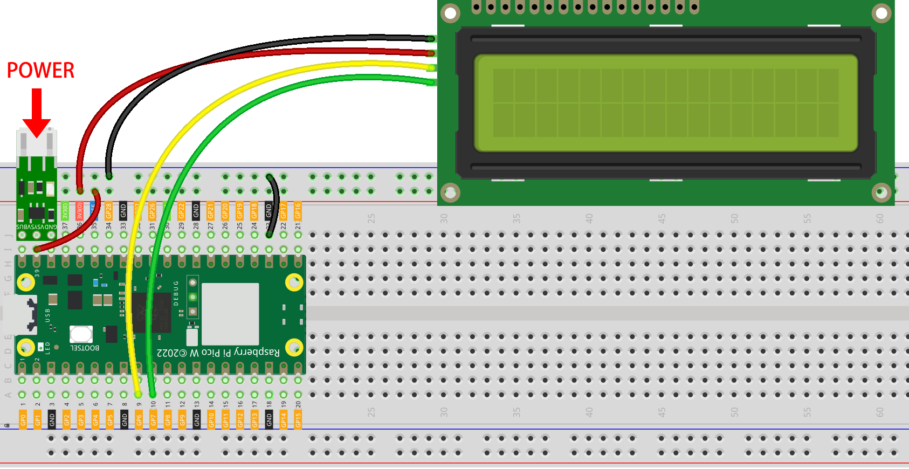
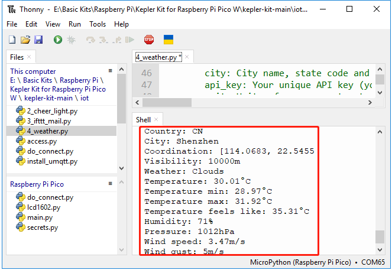

4. Real-time Weather From @OpenWeatherMap 
===========================================

This project involves making a smart clock that prints the weather in your city along with the time on the LCD.

**Bill of Materials**

In this project, we need the following components. 

It's definitely convenient to buy a whole kit, here's the link: 

.. list-table::
    :widths: 20 20 20
    :header-rows: 1

    *   - Name	
        - ITEMS IN THIS KIT
        - LINK
    *   - Kepler Kit	
        - 450+
        - |link_kepler_kit|

You can also buy them separately from the links below.

.. list-table::
    :widths: 5 20 5 20
    :header-rows: 1

    *   - SN
        - COMPONENT	
        - QUANTITY
        - LINK

    *   - 1
        - Raspberry Pi Pico W
        - 1
        - |link_picow_buy|
    *   - 2
        - Micro USB Cable
        - 1
        - 
    *   - 3
        - Breadboard
        - 1
        - |link_breadboard_buy|
    *   - 4
        - Wires
        - Several
        - |link_wires_buy|
    *   - 5
        - I2C LCD1602
        - 1
        - |link_i2clcd1602_buy|
    *   - 6
        - Li-po Charger Module
        - 1
        -  
    *   - 7
        - 18650 Battery
        - 1
        -  
    *   - 8
        - Battery Holder
        - 1
        -  

**1. Build the Circuit**

    .. warning:: 
        
        Make sure your Li-po Charger Module is connected as shown in the diagram. Otherwise, a short circuit will likely damage your battery and circuitry.

**2. Get OpenWeather API keys**

|link_openweather| is an online service, owned by OpenWeather Ltd, that provides global weather data via API, including current weather data, forecasts, nowcasts and historical weather data for any geographical location.

#. Visit |link_openweather| to log in/create an account.

    .. image:: img/OWM-1.png

#. Click into the API page from the navigation bar.

    .. image:: img/OWM-2.png

#. Find **Current Weather Data** and click Subscribe.

    .. image:: img/OWM-3.png

#. Under **Current weather and forecasts collection**, subscribe to the appropriate service. In our project, Free is good enough.

   .. image:: img/OWM-4.png

#. Copy the Key from the **API keys** page.

   .. image:: img/OWM-5.png

#. Copy it to the ``secrets.py`` script in Raspberry Pi Pico W.

    .. image:: img/4_openweather1.png

    .. note::

        If you don't have ``do_connect.py`` and ``secrets.py`` scripts in your Pico W, please refer to :ref:`iot_access` to create them.

    .. code-block:: python
        :emphasize-lines: 5

        secrets = {
        'ssid': 'SSID',
        'password': 'PASSWORD',
        'webhooks_key':'WEBHOOKS_API_KEY',
        'openweather_api_key':'OPENWEATHERMAP_API_KEY'
        }

**3. Run the Script**

#. Open the ``4_weather.py`` file under the path of ``kepler-kit-main/iot``, click the **Run current script** button or press F5 to run it.

    .. image:: img/4_openweather2.png

#. After the script runs, you will see the time and weather information of your location on the I2C LCD1602.

    .. note:: 

        When the code is running, if the screen is blank, you can turn the potentiometer on the back of the module to increase the contrast.

#. If you want this script to be able to boot up, you can save it to the Raspberry Pi Pico W as ``main.py``.

**How it works?**

The Raspberry Pi Pico W needs to be connected to the Internet, as described in :ref:`iot_access`. For this project, just use it.

.. code-block:: python

    from do_connect import *
    do_connect()

After connecting to the Internet, these few lines of code will help synchronize your Pico W to Greenwich Mean Time.

.. code-block:: python

   import ntptime
   while True:
      try:
         ntptime.settime()
         print('Time Set Successfully')
         break
      except OSError:
         print('Time Setting...')
         continue   

Initialize your LCD, please refer to :ref:`py_lcd` for its usage details.

.. code-block:: python

   from lcd1602 import LCD
   lcd=LCD()
   lcd.clear() 
   string = 'Loading...'
   lcd.message(string)

We need to select the unit for some weather data (e.g. temperature, wind speed) before we get the weather data. In this case, the unit is ``metric``.

.. code-block:: python

   # Open Weather
   TEMPERATURE_UNITS = {
      "standard": "K",
      "metric": "°C",
      "imperial": "°F",
   }

   SPEED_UNITS = {
      "standard": "m/s",
      "metric": "m/s",
      "imperial": "mph",
   }

   units = "metric"

Next, this function gets the weather data from ``openweathermap.org``.
We will post a URL message to it with your city, API keys, and a set unit.
As a result, you will receive a ``JSON`` file with weather data.

.. code-block:: python

   def get_weather(city, api_key, units='metric', lang='en'):
      '''
      Get weather data from openweathermap.org
         city: City name, state code and country code divided by comma, Please, refer to ISO 3166 for the state codes or country codes. https://www.iso.org/obp/ui/#search
         api_key: Your unique API key (you can always find it on your openweather account page under the "API key" tab https://home.openweathermap.org/api_keys)
         unit: Units of measurement. standard, metric and imperial units are available. If you do not use the units parameter, standard units will be applied by default. More: https://openweathermap.org/current#data
         lang: You can use this parameter to get the output in your language. More: https://openweathermap.org/current#multi
      '''
      url = f"https://api.openweathermap.org/data/2.5/weather?q={city}&appid={api_key}&units={units}&lang={lang}"
      print(url)
      res = urequests.post(url)
      return res.json()

If you print out this set of raw data, you will be able to see information similar to that shown below.

.. code-block:: python

   weather data example:
   {
       'timezone': 28800,
       'sys': {
           'type': 2,
           'sunrise': 1659650200,
           'country': 'CN',
           'id': 2031340,
           'sunset': 1659697371
       },
       'base': 'stations',
       'main': {
           'pressure': 1008,
           'feels_like': 304.73,
           'temp_max': 301.01,
           'temp': 300.4,
           'temp_min': 299.38,
           'humidity': 91,
           'sea_level': 1008,
           'grnd_level': 1006
       },
       'visibility': 10000,
       'id': 1795565,
       'clouds': {
           'all': 96
       }, 
       'coord': {
           'lon': 114.0683,
           'lat': 22.5455
       },
       'name': 'Shenzhen',
       'cod': 200,
       'weather':[{
           'id': 804,
           'icon': '04d',
           'main': 'Clouds',
           'description': 'overcast clouds'
       }],
       'dt': 1659663579,
       'wind': {
           'gust': 7.06,
           'speed': 3.69,
           'deg': 146
       }
   }

We used the ``print_weather(weather_data)`` function to convert these raw data into easy-to-read data format and print them.

But this function is not called, and you can uncomment this line in ``while True`` as needed.

.. code-block:: python
   :emphasize-lines: 2

   # shell print
   print_weather(weather_data)

In the ``while True`` loop, the ``get_weather()`` function is called first to retrieve the ``weather``, ``temperature`` and ``humidity`` information needed for this project.

.. code-block:: python

   weather_data = get_weather('shenzhen', secrets['openweather_api_key'], units=units)
   weather=weather_data["weather"][0]["main"]
   t=weather_data["main"]["temp"]
   rh=weather_data["main"]["humidity"]

Get the local time. The ``time.localtime()`` function is called here to return a set of tuples (year, month, mday, hour, minute, second, weekday, yearday). We have taken ``hour`` and ``minute`` out of it.

Note that we have already synchronized Pico W to Greenwich Mean Time, so we need to add the time zone of your location.

.. code-block:: python

   hours=time.localtime()[3]+int(weather_data["timezone"] / 3600)
   mins=time.localtime()[4]

Finally, the weather information and time are just displayed in the LCD1602.

.. code-block:: python

   lcd.clear() 
   time.sleep_ms(200)
   string = f'{hours:02d}:{mins:02d} {weather}\n'
   lcd.message(string)
   string = f'{t}{TEMPERATURE_UNITS[units]} {rh}%rh'
   lcd.message(string)

Your LCD1602 will become a clock that refreshes every 30 seconds when the main loop runs every 30 seconds.

.. OPW的文档页面，可以查找每种产品的所有技术信息。https://openweathermap.org/api

.. 查看获取到的key https://home.openweathermap.org/api_keys
.. 当前天气的资料页 https://openweathermap.org/current
.. https://openweathermap.org/appid