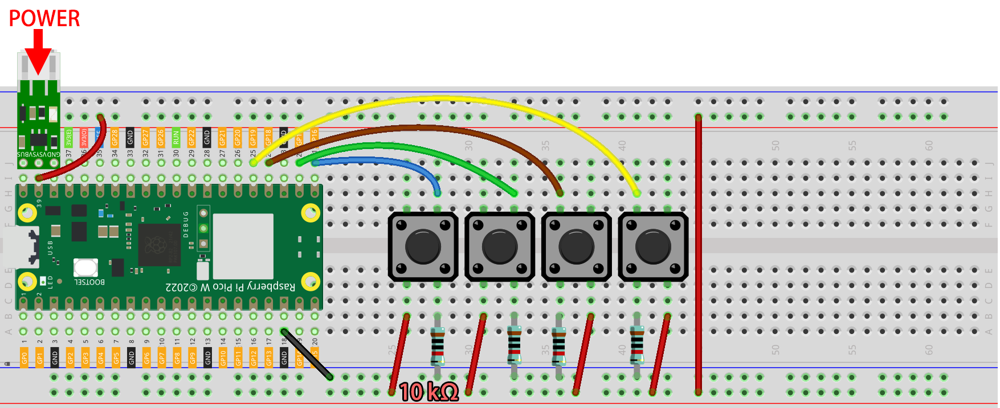

.. note::

    こんにちは、SunFounderのRaspberry Pi & Arduino & ESP32愛好家コミュニティへようこそ！Facebook上でRaspberry Pi、Arduino、ESP32についてもっと深く掘り下げ、他の愛好家と交流しましょう。

    **参加する理由は？**

    - **エキスパートサポート**：コミュニティやチームの助けを借りて、販売後の問題や技術的な課題を解決します。
    - **学び＆共有**：ヒントやチュートリアルを交換してスキルを向上させましょう。
    - **独占的なプレビュー**：新製品の発表や先行プレビューに早期アクセスしましょう。
    - **特別割引**：最新製品の独占割引をお楽しみください。
    - **祭りのプロモーションとギフト**：ギフトや祝日のプロモーションに参加しましょう。

    👉 私たちと一緒に探索し、創造する準備はできていますか？[|link_sf_facebook|]をクリックして今すぐ参加しましょう！

.. _nt_mqtt_publish:

5. @MQTTを使用したクラウド呼び出しシステム
============================================

Message Queuing Telemetry Transport（MQTT）はシンプルなメッセージングプロトコルです。
また、IoT（Internet of Things）の最も一般的なメッセージングプロトコルでもあります。

MQTTプロトコルは、IoTデバイスがデータを転送する方法を定義します。
これらはイベント駆動であり、Pub/Subモデルを使用して相互接続されています。
送信者（Publisher）と受信者（Subscriber）は、トピックを介して通信します。
デバイスが特定のトピックでメッセージを公開すると、そのトピックに登録されたすべてのデバイスがメッセージを受け取ります。

このセクションでは、Pico W、HiveMQ（無料の公開MQTTブローカーサービス）、および4つのボタンを使用してサービスベルシステムを作成します。
4つのボタンはレストランの4つのテーブルを意味し、顧客がボタンを押すとHiveMQでどのテーブルのゲストがサービスが必要かが表示されます。

**1. 必要なコンポーネント**

このプロジェクトには、以下のコンポーネントが必要です。

全体のキットを購入するのが確かに便利です、リンクはこちら：

.. list-table::
    :widths: 20 20 20
    :header-rows: 1

    *   - 名前
        - このキットに含まれるアイテム
        - リンク
    *   - Kepler Kit
        - 450以上
        - |link_kepler_kit|

以下のリンクから個別にも購入できます。

.. list-table::
    :widths: 5 20 5 20
    :header-rows: 1

    *   - SN
        - コンポーネント
        - 数量
        - リンク

    *   - 1
        - :ref:`cpn_pico_w`
        - 1
        - |link_picow_buy|
    *   - 2
        - Micro USBケーブル
        - 1
        - 
    *   - 3
        - :ref:`cpn_breadboard`
        - 1
        - |link_breadboard_buy|
    *   - 4
        - :ref:`cpn_wire`
        - 数本
        - |link_wires_buy|
    *   - 5
        - :ref:`cpn_resistor`
        - 4(10KΩ)
        - |link_resistor_buy|
    *   - 6
        - :ref:`cpn_button`
        - 4
        - |link_button_buy|
    *   - 7
        - :ref:`cpn_lipo_charger`
        - 1
        -  
    *   - 8
        - 18650バッテリー
        - 1
        -  
    *   - 9
        - バッテリーホルダー
        - 1
        -  

**2. 回路を組み立てる**

    .. warning:: 
        
        図に示されているようにLi-po充電モジュールが接続されていることを確認してください。それ以外の場合、短絡が原因でバッテリーや回路が壊れる可能性があります。

**3. HiveMQにアクセス**

HiveMQは、IoTデバイスへの迅速かつ効率的な信頼性の高いデータ転送を可能にするMQTTブローカーおよびクライアントベースのメッセージングプラットフォームです。

1. ブラウザで |link_hivemq| を開きます。

2. クライアントをデフォルトの公開プロキシに接続します。

   .. image:: img/mqtt-1.png

3. **新しいトピックの購読を追加** をクリックします。

   .. image:: img/mqtt-2.png

4. フォローしたいトピックを入力し、 **購読** をクリックします。ここで設定するトピックは、他のユーザーからメッセージを受け取らないように、より個別化されるべきです。また、大文字と小文字に注意してください。

   .. image:: img/mqtt-3.png

**4. MQTTモジュールのインストール**

プロジェクトを開始する前に、Pico W用のMQTTモジュールをインストールする必要があります。

1. 既に書いた ``do_connect()`` をShellで実行してネットワークに接続します。

    .. note::
        * 以下のコマンドをShellに入力し、 ``Enter`` を押して実行します。
        * もしPico Wに ``do_connect.py`` と ``secrets.py`` スクリプトがない場合は、 :ref:`iot_access` を参照して作成してください。

    .. code-block:: python

        from do_connect import *
        do_connect()

2. 成功したネットワーク接続の後、シェルで ``mip`` モジュールをインポートし、MicroPython用の簡易化されたMQTTクライアントである ``umqtt.simple`` モジュールを ``mip`` でインストールします。

    .. code-block:: python

        import mip
        mip.install('umqtt.simple')

3. インストールが完了したら、 ``umqtt`` モジュールがPico Wの ``/lib/`` パスにインストールされていることがわかります。

    .. image:: img/5_calling_system1.png

**5. スクリプトを実行する**

#. ``kepler-kit-main/iot`` のパス下で ``5_mqtt_publish.py`` ファイルを開きます。

#. **現在のスクリプトを実行する** ボタンをクリックするか、F5キーを押して実行します。

    .. image:: img/5_calling_system2.png

#. 再度 |link_hivemq| に戻って、ブレッドボード上のボタンのいずれかを押すと、HiveMQ上でメッセージプロンプトが表示されます。

    .. image:: img/mqtt-4.png

#. このスクリプトが起動できるようにしたい場合、それをRaspberry Pi Pico Wに ``main.py`` として保存できます。

**動作の仕組みは？**

Raspberry Pi Pico Wは、 :ref:`iot_access` で説明されているように、インターネットに接続する必要があります。このプロジェクトではそのまま使用します。

.. code-block:: python

    from do_connect import *
    do_connect()

4つのボタンピンを初期化します。

.. code-block:: python

    sensor1 = Pin(16, Pin.IN)
    sensor2 = Pin(17, Pin.IN)
    sensor3 = Pin(18, Pin.IN)
    sensor4 = Pin(19, Pin.IN)

MQTTブローカーに接続するために使用する ``URL`` と ``client ID`` を保存するための2つの変数を作成します。
公開ブローカーを使用しているので、 ``client ID`` は必須ではありません。

.. code-block:: python

    mqtt_server = 'broker.hivemq.com'
    client_id = 'Jimmy'

MQTTエージェントに接続し、1時間保持します。失敗した場合は、Pico Wをリセットします。

.. code-block:: python

    try:
        client = MQTTClient(client_id, mqtt_server, keepalive=3600)
        client.connect()
        print('Connected to %s MQTT Broker'%(mqtt_server))
    except OSError as e:
        print('Failed to connect to the MQTT Broker. Reconnecting...')
        time.sleep(5)
        machine.reset()

変数 ``topic`` を作成します。これは、購読者がフォローする必要があるトピックです。それは上記の **2. HiveMQに訪れる** の **ステップ4** で記入したトピックと同じでなければなりません。
ちなみに、ここでの ``b`` は、MQTTがバイナリベースのプロトコルであるため、文字列をバイトに変換します。

.. code-block:: python

    topic = b'SunFounder MQTT Test'

各ボタンに割り込みを設定します。ボタンが押されたら、 ``topic`` の下にメッセージが投稿されます。

.. code-block:: python

    def press1(pin):
        message = b'button 1 is pressed'
        client.publish(topic, message)
        print(message)

    sensor1.irq(trigger=machine.Pin.IRQ_RISING, handler=press1)

* `UMQTTクライアントAPI  <https://pypi.org/project/micropython-umqtt.simple/>`_

.. https://www.tomshardware.com/how-to/send-and-receive-data-raspberry-pi-pico-w-mqtt
