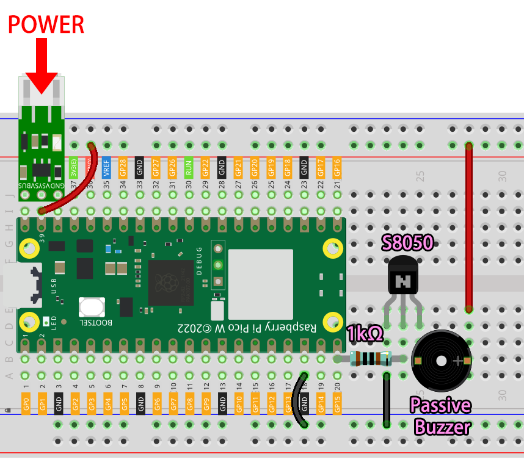

.. _nt_mqtt_Subscribe:

6. Cloud Player with @MQTT
=========================================

It is recommended that you do the :ref:`nt_mqtt_publish` project first to complete the installation of some modules and to complete the configuration of the HiveMQ platform.

In this project, Pico W will act as a subscriber and receive the song name under the topic.
If the song name is already in the code, Pico W will make the buzzer play the song.

**Bill of Materials**

In this project, we need the following components. 

It's definitely convenient to buy a whole kit, here's the link: 

.. list-table::
    :widths: 20 20 20
    :header-rows: 1

    *   - Name	
        - ITEMS IN THIS KIT
        - LINK
    *   - Kepler Kit	
        - 450+
        - |link_kepler_kit|

You can also buy them separately from the links below.

.. list-table::
    :widths: 5 20 5 20
    :header-rows: 1

    *   - SN
        - COMPONENT	
        - QUANTITY
        - LINK

    *   - 1
        - Raspberry Pi Pico W
        - 1
        - |link_picow_buy|
    *   - 2
        - Micro USB Cable
        - 1
        - 
    *   - 3
        - Breadboard
        - 1
        - |link_breadboard_buy|
    *   - 4
        - Wires
        - Several
        - |link_wires_buy|
    *   - 5
        - Transistor
        - 1(S8050)
        - |link_transistor_buy|
    *   - 6
        - Resistor
        - 1(1KΩ)
        - |link_resistor_buy|
    *   - 7
        - Passive Buzzer
        - 1
        - |link_passive_buzzer_buy|
    *   - 8
        - Li-po Charger Module
        - 1
        -  
    *   - 9
        - 18650 Battery
        - 1
        -  
    *   - 10
        - Battery Holder
        - 1
        -  

**1. Build the Circuit**

Two buzzers are included in the kit, we use a passive buzzer (one with an exposed PCB on the back). The buzzer needs a transistor to work, here we use S8050.

    .. warning:: 
        
        Make sure your Li-po Charger Module is connected as shown in the diagram. Otherwise, a short circuit will likely damage your battery and circuitry.

**2. Run the Code**

#. Upload the ``play_music.py`` file under the path of ``kepler-kit-main/iot`` to the Raspberry Pi Pico W.

    .. image:: img/mqtt-A-1.png

#. Open the ``6_mqtt_subscribe_music.py`` file under the path of ``kepler-kit-main/iot`` and click the **Run current script** button or press F5 to run it.

    .. image:: img/6_cloud_player.png

    .. note::
        Before running the code, you need to make sure you have ``do_connect.py`` and ``secrets.py`` scripts in your Pico W, if not please refer to :ref:`iot_access` to create them.

#. Open |link_hivemq| in your browser, fill in the Topic as ``SunFounder MQTT Music``, fill in the song name as **Message**. After clicking **Publish** button, the buzzer connected to the Pico W will play the corresponding song.

    .. note::
        Included in play_music.py are ``nokia``, ``starwars``, ``nevergonnagiveyouup``, ``gameofthrone``, ``songofstorms``, ``zeldatheme``, ``harrypotter``.

    .. image:: img/mqtt-5.png
        :width: 500

#. If you want this script to be able to boot up, you can save it to the Raspberry Pi Pico W as ``main.py``.

**How it works?**

In order to make it easier to understand, we separated the MQTT code from the rest.
As a result, you get the following code, which implements the most basic functionality of MQTT subscriptions in three places.

.. code-block:: python
    :emphasize-lines: 13,14,15,16,20,28,29,30

    import time
    from umqtt.simple import MQTTClient

    from do_connect import *
    do_connect()

    mqtt_server = 'broker.hivemq.com'
    client_id = 'Jimmy'

    # to subscribe the message
    topic = b'SunFounder MQTT Music'

    def callback(topic, message):
        print("New message on topic {}".format(topic.decode('utf-8')))
        message = message.decode('utf-8')
        print(message)

    try:
        client = MQTTClient(client_id, mqtt_server, keepalive=60)
        client.set_callback(callback)
        client.connect()
        print('Connected to %s MQTT Broker'%(mqtt_server))
    except OSError as e:
        print('Failed to connect to MQTT Broker. Reconnecting...')
        time.sleep(5)
        machine.reset()
        
    while True:
        client.subscribe(topic)
        time.sleep(1)

When connecting to the MQTT broker, we call the ``client.set_callback(callback)`` function, which serves as a callback for the received subscription messages.

.. code-block:: python
    :emphasize-lines: 3

    try:
        client = MQTTClient(client_id, mqtt_server, keepalive=60)
        client.set_callback(callback)
        client.connect()
        print('Connected to %s MQTT Broker'%(mqtt_server))
    except OSError as e:
        print('Failed to connect to MQTT Broker. Reconnecting...')
        time.sleep(5)
        machine.reset()

Next is the callback function, which prints out the message from the topic that was fetched.
MQTT is a binary based protocol were the control elements are binary bytes and not text strings, so these messages need to be decoded using ``message.decode('utf-8')``.

.. code-block:: python

    def callback(topic, message):
        print("New message on topic {}".format(topic.decode('utf-8')))
        message = message.decode('utf-8')
        print(message)

Use a ``While True`` loop to get messages under this topic at regular intervals.

.. code-block:: python

    while True:
        client.subscribe(topic)
        time.sleep(1)

        
Next, music will be played. This function is placed in the ``play_music.py`` script, which consists of three main parts.

   * ``Tone``: Simulates a specific tone based on the fundamental |link_piano_frequency| , which is used to play it.

        .. code-block:: python

            NOTE_B0 =  31
            NOTE_C1 =  33
            ...
            NOTE_DS8 = 4978
            REST =      0

   * ``Score``: Edit the music into a format that the program can use. These scores are from `Robson Couto's free sharing <https://github.com/robsoncouto/arduino-songs>`_, you can also add your favorite music in the following format.

    .. code-block:: python

        # notes of the moledy followed by the duration.
        # a 4 means a quarter note, 8 an eighteenth , 16 sixteenth, so on
        # !!negative numbers are used to represent dotted notes,
        # so -4 means a dotted quarter note, that is, a quarter plus an eighteenth!!
        song = {
            "nokia":[NOTE_E5, 8, NOTE_D5, 8, NOTE_FS4, 4, NOTE_GS4, 4, NOTE_CS5, 8, NOTE_B4, 8, NOTE_D4, 4, 
                        NOTE_E4, 4,NOTE_B4, 8, NOTE_A4, 8, NOTE_CS4, 4, NOTE_E4, 4, NOTE_A4, 2],
            "starwars":[,,,],
            "nevergonnagiveyouup":[,,,],
            "gameofthrone":[,,,],
            "songofstorms":[,,,],
            "zeldatheme":[,,,],
            "harrypotter":[,,,],
        }

    * ``Play``: This part is basically the same as :ref:`py_pa_buz`, but slightly optimized to fit the above score.

   .. code-block:: python

       import time
       import machine

       # change this to make the song slower or faster
       tempo = 220

       # this calculates the duration of a whole note in ms
       wholenote = (60000 * 4) / tempo

       def tone(pin,frequency,duration):
           if frequency is 0:
               pass
           else:
               pin.freq(frequency)
               pin.duty_u16(30000)
           time.sleep_ms(duration)
           pin.duty_u16(0)

       def noTone(pin):
           tone(pin,0,100)

       def play(pin,melody):

           # iterate over the notes of the melody.
           # Remember, the array is twice the number of notes (notes + durations)
           for thisNote in range(0,len(melody),2):
               # calculates the duration of each note
               divider = melody[thisNote+1]
               if divider > 0:
                   noteDuration = wholenote/divider
               elif divider < 0:
                   noteDuration = wholenote/-(divider)
                   noteDuration *= 1.5

               # we only play the note for 90% of the duration, leaving 10% as a pause
               tone(pin,melody[thisNote],int(noteDuration*0.9))

               # Wait for the specief duration before playing the next note.
               time.sleep_ms(int(noteDuration))

               # stop the waveform generation before the next note.
               noTone(pin)

Go back to the main function and let MQTT trigger music playback.
In the callback function, determine if the message sent is the name of a song that has been included.
If it is, assign the song name to the variable ``melody`` and set ``play_flag`` to ``True``.

.. code-block:: python
    :emphasize-lines: 5,6,7,8

    def callback(topic, message):
        print("New message on topic {}".format(topic.decode('utf-8')))
        message = message.decode('utf-8')
        print(message)
        if message in song.keys():
            global melody,play_flag
            melody = song[message]
            play_flag = True

In the main loop, if ``play_flag`` is ``True``, play ``melody``.

.. code-block:: python
    :emphasize-lines: 4,5,6

    while True:
        client.subscribe(topic)
        time.sleep(1)
        if play_flag is True:
            play(buzzer,melody)
            play_flag = False