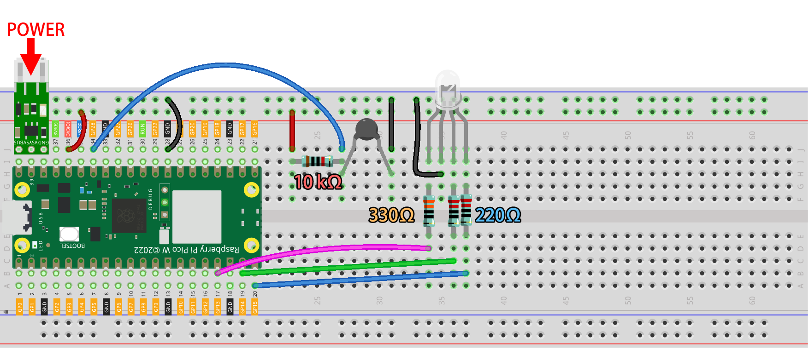

.. note::

    ¡Hola! Bienvenido a la Comunidad de Entusiastas de SunFounder para Raspberry Pi, Arduino y ESP32 en Facebook. Sumérgete en el mundo de Raspberry Pi, Arduino y ESP32 junto a otros entusiastas.

    **¿Por qué unirse?**

    - **Soporte Experto**: Resuelve problemas posventa y desafíos técnicos con la ayuda de nuestra comunidad y equipo.
    - **Aprende y Comparte**: Intercambia consejos y tutoriales para mejorar tus habilidades.
    - **Previsualizaciones Exclusivas**: Obtén acceso anticipado a anuncios de nuevos productos y adelantos exclusivos.
    - **Descuentos Especiales**: Disfruta de descuentos exclusivos en nuestros productos más recientes.
    - **Promociones Festivas y Sorteos**: Participa en sorteos y promociones de temporada.

    👉 ¿Listo para explorar y crear con nosotros? Haz clic en [|link_sf_facebook|] y únete hoy.

7. Configurar un Servidor Web
====================================

En este artículo, aprenderás cómo convertir el Pico W en un servidor web que te permita operar el circuito y obtener lecturas del sensor desde un navegador.

|setup_web|

**1. Componentes Requeridos**

Para este proyecto, necesitamos los siguientes componentes.

Es conveniente adquirir el kit completo; aquí tienes el enlace:

.. list-table::
    :widths: 20 20 20
    :header-rows: 1

    *   - Nombre	
        - ELEMENTOS EN ESTE KIT
        - ENLACE
    *   - Kit Kepler	
        - 450+
        - |link_kepler_kit|

También puedes comprarlos por separado a través de los enlaces a continuación.

.. list-table::
    :widths: 5 20 5 20
    :header-rows: 1

    *   - N.º
        - COMPONENTE	
        - CANTIDAD
        - ENLACE

    *   - 1
        - :ref:`cpn_pico_w`
        - 1
        - |link_picow_buy|
    *   - 2
        - Cable Micro USB
        - 1
        - 
    *   - 3
        - :ref:`cpn_breadboard`
        - 1
        - |link_breadboard_buy|
    *   - 4
        - :ref:`cpn_wire`
        - Varios
        - |link_wires_buy|
    *   - 5
        - :ref:`cpn_resistor`
        - 4(1-330Ω, 2-220Ω, 1-10KΩ)
        - |link_resistor_buy|
    *   - 6
        - :ref:`cpn_rgb`
        - 1
        - |link_rgb_led_buy|
    *   - 7
        - :ref:`cpn_thermistor`
        - 1
        - |link_thermistor_buy|
    *   - 8
        - :ref:`cpn_lipo_charger`
        - 1
        -  
    *   - 9
        - Batería 18650
        - 1
        -  
    *   - 10
        - Portapilas
        - 1
        -  

**2. Construcción del Circuito**

    .. warning:: 
        
        Asegúrate de que el Módulo de Carga Li-po esté conectado como se muestra en el diagrama. De lo contrario, un cortocircuito podría dañar tu batería y el circuito.

**3. Ejecutar el Código**

#. Abre el archivo ``7_web_page.py`` en la ruta ``kepler-kit-main/iot``.
#. Haz clic en el botón **Run current script** o presiona F5 para ejecutarlo. Después de una conexión exitosa, verás la IP del Pico W.

    .. image:: img/7_web_server.png

    .. note::

        Antes de ejecutar el código, asegúrate de tener los scripts ``do_connect.py`` y ``secrets.py`` en tu Pico W. Si no los tienes, consulta :ref:`iot_access` para crearlos.

#. Ingresa la dirección IP del Pico W en tu navegador para acceder a la página web creada para este proyecto. Haz clic en cualquier botón para cambiar el color de los LED RGB y actualizar la temperatura y la humedad.

    .. image:: img/web-1.png
        :width: 500

#. Si deseas que este script se ejecute al iniciar, puedes guardarlo en la Raspberry Pi Pico W como ``main.py``.

**Cómo funciona**

La página web que estás visitando en realidad está alojada en un servidor, y el socket en el servidor enviará la página cuando accedamos a ella.
Un socket es la forma en que un servidor puede escuchar a un cliente que desea conectarse a él.

En este proyecto, el Pico W actúa como tu servidor, y tu computadora accede a la página web alojada en el Pico W a través de un navegador.

Primero, creamos un socket, el cual requiere una dirección IP y un |link_port|.
La conexión de red y la forma de obtener la IP se describen en :ref:`iot_access`. Para el puerto, utilizamos el 80.
Después de configurar el socket, lo devolvemos para usarlo en el siguiente paso.

`socket library - Python Docs <https://docs.python.org/3/library/socket.html>`_ 

.. code-block:: python

    import socket

    def open_socket(ip):
        # Abrir un socket
        address = (ip, 80)
        connection = socket.socket()
        connection.bind(address)
        connection.listen(1)
        print(connection)
        return(connection)

Luego, configura tu servicio web utilizando el socket que configuraste anteriormente.
El siguiente código permite que tu Pico W reciba solicitudes de acceso desde tu navegador.

.. code-block:: python

    def serve(connection):
        while True:
            client = connection.accept()[0]
            request = client.recv(1024)
            client.close()

A continuación, necesitas una página html para enviar al visitante. Este ejemplo almacena una página html sencilla en forma de cadena en la variable ``html``.

.. note:: 
    Si deseas escribir tu propio html, puedes obtener ayuda en |link_html|.

.. code-block:: python

    def webpage(value):
        html = f"""
                <!DOCTYPE html>
                <html>
                <body>
                <form action="./red">
                <input type="submit" value="red " />
                </form>
                <form action="./green">
                <input type="submit" value="green" />
                </form>
                <form action="./blue">
                <input type="submit" value="blue" />
                </form>
                <form action="./off">
                <input type="submit" value="off" />
                </form>
                
Temperature is {value} degrees Celsius

                </body>
                </html>
                """
        return html

Envía la página html al visitante.

.. code-block:: python
    :emphasize-lines: 5,6

    def serve(connection):
        while True:
            client = connection.accept()[0]
            request = client.recv(1024)
            html=webpage(0)
            client.send(html)
            client.close()

Puedes acceder a la página a través de tu navegador si combinas las partes anteriores. Si quieres ver el efecto, ejecuta el código siguiente en Thonny.

.. code-block:: python

    import machine
    import socket

    from secrets import *
    from do_connect import *

    def webpage(value):
        html = f"""
                <!DOCTYPE html>
                <html>
                <body>
                <form action="./red">
                <input type="submit" value="red " />
                </form>
                <form action="./green">
                <input type="submit" value="green" />
                </form>
                <form action="./blue">
                <input type="submit" value="blue" />
                </form>
                <form action="./off">
                <input type="submit" value="off" />
                </form>
                
Temperature is {value} degrees Celsius

                </body>
                </html>
                """
        return html

    def open_socket(ip):
        # Abrir un socket
        address = (ip, 80)
        connection = socket.socket()
        connection.bind(address)
        connection.listen(1)
        print(connection)
        return(connection)

    def serve(connection):
        while True:
            client = connection.accept()[0]
            request = client.recv(1024)
            html=webpage(0)
            client.send(html)
            client.close()

    try:
        ip=do_connect()
        if ip is not None:
            connection=open_socket(ip)
            serve(connection)
    except KeyboardInterrupt:
        machine.reset()

Cuando ejecutes el código anterior, verás que solo muestra una página web, pero no te permite controlar los LEDs RGB ni mostrar lecturas de sensores.
El servicio web necesita refinarse aún más.

Lo primero que necesitamos saber es qué información recibe el servidor cuando el navegador accede a la página web. Por lo tanto, modifica ligeramente ``serve()`` para imprimir ``request``.

.. code-block:: python
    :emphasize-lines: 5,6

    def serve(connection):
        while True:
            client = connection.accept()[0]
            request = client.recv(1024)
            request = str(request)
            print(request)  
            html=webpage(0)
            client.send(html)
            client.close()

Ejecuta nuevamente el script y el Shell imprimirá el siguiente mensaje cuando presionamos un botón en la página web.

.. code-block:: 

    b'GET /red? HTTP/1.1\r\nHost: 192.168.18.162\r\nConnection: keep-alive.......q=0.5\r\n\r\n'
    b'GET /favicon.ico HTTP/1.1\r\nHost: 192.168.18.162\r\nConnection: keep-alive.......q=0.5\r\n\r\n'
    b'GET /blue? HTTP/1.1\r\nHost: 192.168.18.162\r\nConnection: keep-alive.......q=0.5\r\n\r\n'
    b'GET /favicon.ico HTTP/1.1\r\nHost: 192.168.18.162\r\nConnection: keep-alive.......q=0.5\r\n\r\n'

¡Son demasiado largos para leer! 

Pero todo lo que realmente necesitamos es la pequeña parte de información frente a ``/red?``, ``/blue?``.
Nos dice qué botón fue presionado. Refinamos ``serve()`` un poco para extraer la información de la tecla.

.. code-block:: python
    :emphasize-lines: 6,7,8,9

    def serve(connection):
        while True:
            client = connection.accept()[0]
            request = client.recv(1024)
            request = str(request)
            try:
                request = request.split()[1]
            except IndexError:
                pass
            print(request)  
            html=webpage(0)
            client.send(html)
            client.close()

Ejecuta de nuevo el programa y el Shell imprimirá el siguiente mensaje cuando presionamos un botón en la página web.

.. code-block:: 

    /red?
    /favicon.ico
    /blue?
    /favicon.ico
    /off?
    /favicon.ico

Entonces, solo necesitamos cambiar el color del LED RGB de acuerdo al valor de ``request``.

.. code-block:: python

    def serve(connection):
        while True:
            client = connection.accept()[0]
            request = client.recv(1024)
            request = str(request)
            try:
                request = request.split()[1]
            except IndexError:
                pass
            
            print(request)
            
            if request == '/off?':
                red.low()
                green.low()
                blue.low()
            elif request == '/red?':
                red.high()
                green.low()
                blue.low()
            elif request == '/green?':
                red.low()
                green.high()
                blue.low()
            elif request == '/blue?':
                red.low()
                green.low()
                blue.high()
 
            html=webpage(0)
            client.send(html)
            client.close()

Lo último es mostrar el valor del termistor en la página web (consulta :ref:`py_temp` para más detalles sobre el uso del termistor).
Esta parte en realidad se realiza modificando el texto en el html.
Configuramos los parámetros en la función ``webpage(value)`` y simplemente cambiamos los parámetros entrantes para cambiar el número que se muestra en la página web.

.. code-block:: python
    :emphasize-lines: 30,31

    def serve(connection):
        while True:
            client = connection.accept()[0]
            request = client.recv(1024)
            request = str(request)
            try:
                request = request.split()[1]
            except IndexError:
                pass
            
            #print(request)
            
            if request == '/off?':
                red.low()
                green.low()
                blue.low()
            elif request == '/red?':
                red.high()
                green.low()
                blue.low()
            elif request == '/green?':
                red.low()
                green.high()
                blue.low()
            elif request == '/blue?':
                red.low()
                green.low()
                blue.high()

            value='%.2f'%temperature()    
            html=webpage(value)
            client.send(html)
            client.close()

.. https://projects.raspberrypi.org/en/projects/get-started-pico-w/3
