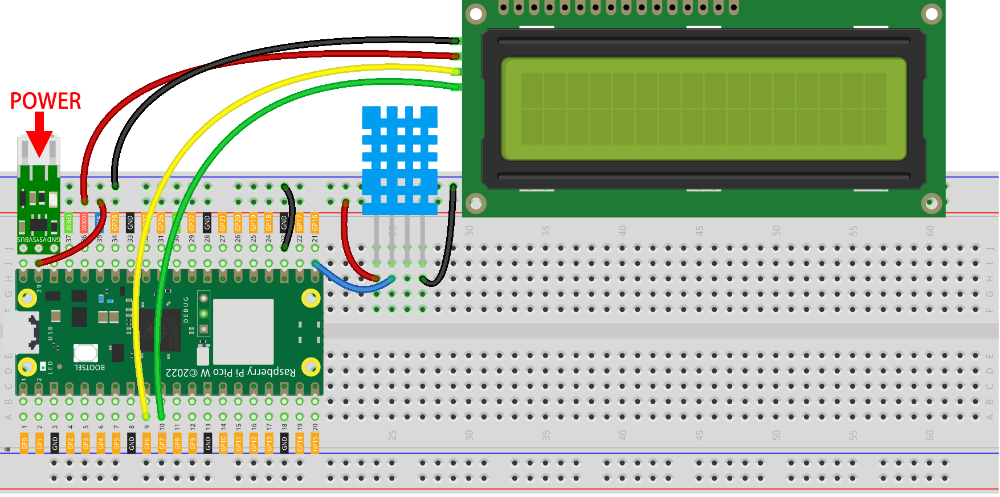

.. note::

    ¡Hola! Bienvenido a la comunidad de entusiastas de SunFounder para Raspberry Pi, Arduino y ESP32 en Facebook. Sumérgete en el mundo de Raspberry Pi, Arduino y ESP32 junto a otros entusiastas.

    **¿Por qué unirte?**

    - **Soporte experto**: Resuelve problemas postventa y desafíos técnicos con la ayuda de nuestra comunidad y equipo.
    - **Aprende y comparte**: Intercambia consejos y tutoriales para mejorar tus habilidades.
    - **Acceso exclusivo**: Obtén acceso anticipado a anuncios de nuevos productos y adelantos.
    - **Descuentos especiales**: Disfruta de descuentos exclusivos en nuestros productos más recientes.
    - **Promociones y sorteos festivos**: Participa en sorteos y promociones especiales por temporada.

    👉 ¿Listo para explorar y crear con nosotros? Haz clic en [|link_sf_facebook|] y únete hoy.

8. Construir una Web APP con @Anvil
=========================================

Escribiremos un proyecto para permitir la comunicación bidireccional entre la Raspberry Pi Pico W y los servidores de Anvil.
La temperatura y humedad transmitidas desde la Pico W se mostrarán en tiempo real en Anvil. Además, podrás ingresar mensajes en Anvil para que se muestren en el I2C LCD1602 de la Pico W.

|anvil|

**1. Componentes necesarios**

En este proyecto, necesitaremos los siguientes componentes.

Es definitivamente conveniente comprar un kit completo, aquí tienes el enlace: 

.. list-table::
    :widths: 20 20 20
    :header-rows: 1

    *   - Nombre	
        - COMPONENTES EN ESTE KIT
        - ENLACE DE COMPRA
    *   - Kit Kepler	
        - 450+
        - |link_kepler_kit|

También puedes comprarlos por separado en los enlaces a continuación.

.. list-table::
    :widths: 5 20 5 20
    :header-rows: 1

    *   - No
        - COMPONENTE	
        - CANTIDAD
        - ENLACE DE COMPRA

    *   - 1
        - :ref:`cpn_pico_w`
        - 1
        - |link_picow_buy|
    *   - 2
        - Cable Micro USB
        - 1
        - 
    *   - 3
        - :ref:`cpn_breadboard`
        - 1
        - |link_breadboard_buy|
    *   - 4
        - :ref:`cpn_wire`
        - Varios
        - |link_wires_buy|
    *   - 5
        - :ref:`cpn_i2c_lcd`
        - 1
        - |link_i2clcd1602_buy|
    *   - 6
        - :ref:`cpn_dht11`
        - 1
        - |link_dht22_buy|
    *   - 7
        - :ref:`cpn_lipo_charger`
        - 1
        -  
    *   - 8
        - Batería 18650
        - 1
        -  
    *   - 9
        - Portapilas
        - 1
        -  

**2. Construye el circuito**

    .. warning:: 
        
        Asegúrate de que tu Módulo de Carga Li-po esté conectado tal como se muestra en el diagrama. De lo contrario, es probable que un cortocircuito dañe la batería y el circuito.

    
**3. Crear una APP en Anvil**

1. Ve a |link_anvil| y haz clic en **Start building**.

    .. image:: img/anvil-1.png

2. Inicia sesión o regístrate.

    .. image:: img/anvil-2.png

3. Crea una **New Blank App**.

    .. image:: img/anvil-3.png

4. Selecciona el **Material Design Theme**.

    .. image:: img/anvil-4.png

5. Ahora estás en la página de edición de la aplicación.

    .. image:: img/anvil-5.png

6. Desde la Caja de Herramientas (Toolbox), arrastra una herramienta **Label** y colócala en **Drop title here**.

    .. image:: img/anvil-6.png

7. Puedes llenar el texto de la etiqueta en el campo **text** dentro del menú **Properties**.

    .. image:: img/anvil-7.png

8. De la misma forma, arrastra un **TextBox** a la derecha.

    .. image:: img/anvil-17.png

9. Arrastra un **button** hacia la derecha y modifica el campo **text**. Este botón se utilizará para "enviar" un mensaje al Raspberry Pi Pico W.

    .. image:: img/anvil-14.png

10. Después de hacer doble clic en el botón **SHOW**, el formulario cambiará de la página de diseño a la página de código y resaltará el código del **button**. Debes introducir el siguiente código, que se usará para llamar a una función dentro del servidor (en este caso, el Pico W). 

    .. code-block:: python
    
        anvil.server.call_s("show_message",self.text_box_1.text)

    * ``show_message`` es la función que se definirá cuando se programe el Pico W.
    * ``self.text_box_1.text`` es el mensaje que introduces en el cuadro de texto, el cual se enviará como argumento a ``show_message()``.

    .. image:: img/anvil-15.png

11. Regresa a la página de diseño, arrastra otra etiqueta y colócala debajo de los elementos anteriores. Esta etiqueta mostrará los datos del sensor DHT11 provenientes del Pico W.

    .. image:: img/anvil-9.png

12. En la **Toolbox**, haz clic en **More Components** y arrastra el **Timer** al formulario.

    .. image:: img/anvil-12.png

13. Usando las **Properties**, ajusta el temporizador a un intervalo de 3 segundos. Este tiempo se utilizará para actualizar la pantalla con los datos del sensor.

    .. image:: img/anvil-18.png

14. Haz doble clic en la herramienta **Timer** para programarla. Usa la función ``anvil.server.call_s()`` para llamar a la función ``publish_data()`` desde el servidor y obtener el mensaje que se debe mostrar en la aplicación de Anvil, asignándolo a ``self.label_2.text``.

    .. code-block:: python

        data=anvil.server.call_s("publish_data")
        self.label_2.text=data
    
    .. image:: img/anvil-16.png

15. En este punto, la parte que debe programarse en Anvil está lista. Puedes ver más detalles sobre el uso de Anvil en |link_anvil_docs|.

**4. Configurar el Pico W**

Para simplificar la conexión del Raspberry Pi Pico W a los servicios de Anvil, Anvil utiliza una imagen de firmware personalizada. El firmware del Pico W está escrito en MicroPython y aparece como una unidad USB con dos archivos (boot.py y main.py). El Pico W debe ser actualizado con el firmware personalizado y conectado a nuestra red Wi-Fi antes de comenzar a escribir código.

1. Descarga el firmware personalizado de Raspberry Pi Pico W en |link_anvil_firmware|, se recomienda descargar la versión completa.

    .. image:: img/anvil-p-1.png

2. Mantén presionado el botón **BOOTSEL** en el Pico W, luego conéctalo a tu computadora usando un cable micro USB. Suelta BOOTSEL una vez que la unidad RPI-RP2 aparezca en tu computadora.

    .. image:: img/anvil-p-2.png
        :width: 300

3. Arrastra y suelta el archivo ``.uf2`` que acabas de descargar y el Pico W instalará el firmware en este punto. Cuando termine, el Pico W recargará la unidad de disco y verás los archivos ``main.py`` y ``boot.py``.

    .. note:: 
        Antes de reinstalar el firmware, realiza una copia de seguridad de todos los archivos importantes que tengas almacenados en el Pico W.

    .. image:: img/anvil-p-3.png

4. Selecciona "MicroPython (Raspberry Pi Pico).COMXX" como el intérprete en el IDE Thonny. Después de hacer clic en **View** -> **Files**, verás la unidad local y el disco duro del Raspberry Pi Pico.

    .. image:: img/anvil-20.png

5. Haz doble clic en el script ``boot.py`` e introduce tu ``SSID`` y ``PASSWORD`` de Wi-Fi.

    .. image:: img/anvil-21.png

**5. Terminar el Código**

#. Sube los archivos ``dht.py`` y ``lcd1602.py`` desde la ruta ``kepler-kit-main/libs`` al Raspberry Pi Pico W.

    .. image:: img/anvil-22.png

#. Abre ``main.py`` y reemplaza el código original con el siguiente código.

    .. code-block:: python

        import anvil.pico
        import uasyncio as a
        from machine import Pin,I2C

        from lcd1602 import LCD
        lcd = LCD()

        from dht import DHT11
        sensor = DHT11(Pin(16, Pin.OUT, Pin.PULL_DOWN))

        UPLINK_KEY = "<uplink_key_goes_here>"

        @anvil.pico.callable(is_async=True)
        async def show_message(text):
            print(f"show anvil's input message: {text}")
            lcd.clear()
            lcd.message(text)
            return

        @anvil.pico.callable(is_async=True)
        async def publish_data():
            sensor.measure()
            return "Temperature: {}, Humidity: {}".format(sensor.temperature, sensor.humidity)

        # Conectar al Anvil Uplink. En MicroPython, esta llamada bloqueará la ejecución indefinidamente.

        anvil.pico.connect(UPLINK_KEY)

        # Hay muchas más cosas que puedes hacer con Anvil en tu Pico W.
        #
        # Consulta https://anvil.works/pico para más información

#. Vuelve a la interfaz de Anvil y selecciona la opción Uplink en la configuración del App Browser.

    .. image:: img/anvil-p-6.png

#. Haz clic en **Enable the Anvil Server Uplink for this app** para obtener la clave de uplink.

    .. image:: img/anvil-p-7.png

#. Cópiala y reemplaza ``<uplink_key_goes_here>`` en ``main.py``, lo que permitirá que tu Pico W se conecte a la aplicación de Anvil que creaste.

    .. image:: img/anvil-p-8.png

**6. Ejecutar el Proyecto**

1. Haz clic en el botón **Run current script** o presiona F5 para ejecutarlo. Después de una conexión exitosa, verás un mensaje de éxito en la Shell.

    .. image:: img/anvil-19.png

2. Ejecuta Anvil, y ahora podrás ver la temperatura y la humedad en la aplicación Anvil. Si haces clic en el botón **SHOW** después de ingresar un mensaje en el cuadro de texto, el I2C LCD1602 mostrará el mensaje que ingresaste.

    .. note:: 
        Si el mensaje que ingresaste no se muestra en el I2C LCD1602, puedes ajustar el potenciómetro en la parte posterior del módulo para aumentar el contraste.

    .. image:: img/anvil-r-2.png

**7. Publicar APP**

Si deseas compartir la aplicación que creaste, puedes generar un enlace compartido de la siguiente manera.

1. Vuelve a la página de **Anvil** y selecciona la opción **publish app** en la configuración del **App Browser**.

    .. image:: img/anvil-s-1.png

2. En la pestaña **Share via private link**, verás una lista de enlaces. Cualquiera puede acceder a tu aplicación a través de este enlace.

    .. image:: img/anvil-s-2.png

3. Accede al enlace y tu aplicación estará lista para ser utilizada directamente.

    .. image:: img/anvil-s-3.png

4. También puedes compartir tu aplicación mediante un enlace público; llena tu nombre de dominio personalizado y haz clic en **Apply** para activarlo.

    .. image:: img/anvil-s-4.png

**Cómo funciona**

Aquí está la estructura básica de ``main.py``, que forma la base de la comunicación entre el Pico W y la aplicación de Anvil.

.. code-block:: python

    import anvil.pico
    import uasyncio as a

    UPLINK_KEY = "<uplink_key_goes_here>"

    # Conectar al Anvil Uplink. En MicroPython, esta llamada bloqueará la ejecución indefinidamente.

    anvil.pico.connect(UPLINK_KEY)

    # Hay muchas más cosas que puedes hacer con Anvil en tu Pico W.
    #
    # Consulta https://anvil.works/pico para más información

Configura dht11 y lcd1602. Los detalles sobre el uso de estos dos componentes se encuentran en :ref:`py_dht11` y :ref:`py_lcd`.

.. code-block:: python
    :emphasize-lines: 5,6

    from machine import Pin,I2C

    from lcd1602 import LCD
    lcd = LCD()

    from dht import DHT11
    sensor = DHT11(Pin(16, Pin.OUT, Pin.PULL_DOWN))

En el código de Anvil, hemos llamado a dos funciones internas del servidor (Pico W).

La primera es ``show_message()``, cuya función es mostrar en el LCD el mensaje ingresado en Anvil.
El decorador ``@anvil.pico.callable(is_async=True)`` hace que esta función sea accesible desde Anvil.

.. code-block:: python

    @anvil.pico.callable(is_async=True)
    async def show_message(text):
        print(f"show anvil's input message: {text}")
        lcd.clear()
        lcd.message(text)
        return

A continuación, está ``publish_data()``, que obtiene el valor del dht11 y devuelve la temperatura y la humedad a Anvil.
También usa el decorador ``@anvil.pico.callable(is_async=True)`` para hacerlo accesible desde Anvil.

.. code-block:: python

    @anvil.pico.callable(is_async=True)
    async def publish_data():
        sensor.measure()
        return "Temperature: {}, Humidity: {}".format(sensor.temperature, sensor.humidity)

