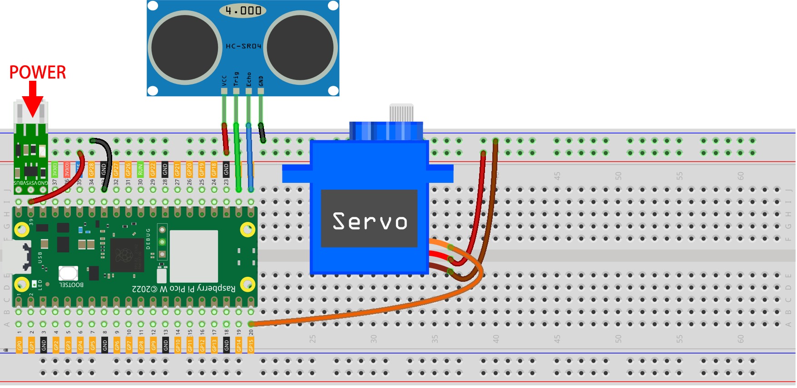

.. _play_sc:

9. Play in @SunFounder Controller
====================================

In this project, you will learn how to build a remote project using Sunfounder Controller APP.
In a LAN environment, you can control your Pico W circuit with your phone/tablet.
You will find this app very useful if you want to build a simple robot with Pico W.

Here, we will use the slider bar on the APP to control the servo angle and the gauge on the APP to show the distance detected by ultrasonic.

**1. Build the Circuit**

.. warning:: 
        
    Make sure your Li-po Charger Module is connected as shown in the diagram. Otherwise, a short circuit will likely damage your battery and circuitry.

**2. Setup SunFounder Controller**

1. Install `SunFounder Controller APP <https://docs.sunfounder.com/projects/sf-controller/en/latest/>`_ from **APP Store(iOS)** or **Google Play(Android)**.

2. Open the APP and click the **+** button on the home page to create a controller.

    .. image:: img/sc-a-2.jpg
        :width: 800

3. Here we choose **Blank** and **Dual Stick**.

    .. image:: img/sc-a-3.jpg
        :width: 800

4. Now we get an empty controller.

    .. image:: img/sc-a-4.jpg
        :width: 800

5. Click on the **H** area and add a **Slider** widget.

    .. image:: img/sc-a-5.jpg
        :width: 800

6. Click the gear on the control to open the settings window.

    .. image:: img/sc-a-6.png
        :width: 300

7. Set Maximum to 180 and Minimum to 0, then click to **Confirm**.

    .. image:: img/sc-a-7.jpg
        :width: 800

8. Click on the L area and add a Gauge widget.

    .. image:: img/sc-a-8.jpg
        :width: 800

9. Click the gear of the Gauge, open the settings window, set Maximum to 100, Minimum to 0, and unit to cm.

    .. image:: img/sc-a-9.jpg
        :width: 800

10. After finishing the widget settings, click Save.

    .. image:: img/sc-a-10.png
        :width: 300

**3. Run the Code**

.. note:: 
    If your Pico W is now using the Anvil firmware, then you will need to :ref:`install_micropython_on_pico`.

1. Upload ``ws.py`` and ``websocket_helper.py`` from the path of ``kepler-kit-main/libs`` to the Raspberry Pi Pico W.

    .. image:: img/9_sc3.png

2. Double click the ``ws.py`` script and fill your WiFi's ``SSID`` and ``PASSWORD``.

    .. image:: img/9_sc1.png

3. Open the ``9_sunfounder_controller.py`` under the path of ``kepler-kit-main/iot``. Click the **Run current script** button or press F5 to run it. After successful connection, you will see the IP of Pico W.

    .. image:: img/9_sc2.png

    .. note::
        If you want this script to be able to boot up, you can save it to the Raspberry Pi Pico W as ``main.py``.

4. Back to SunFounder Controller APP, click the **Connect** button.

    .. image:: img/sc-c-4.jpg
        :width: 300

5. If PicoW is detected, tap it directly to connect.

    .. image:: img/sc-c-5.jpg
        :width: 300

6. If it connects automatically, you can connect by manually entering the IP address of Pico W.

    .. image:: img/sc-c-6.png
        :width: 800

7. When you slide the slider bar in the H area after clicking the Run button, the servo will adjust its angle. The gauge in the L area will show the distance if your hand is within 100cm of the ultrasonic sensor.

    .. image:: img/sc-c-8.jpg
        :width: 300

**How it works?**

The ``WS_Server`` class in the ``ws.py`` library implements communication with the APP. Below is the framework for implementing its basic functionality.

.. code-block:: python

    from ws import WS_Server
    import json
    import time

    ws = WS_Server(8765) # init websocket 

    def main():
        ws.start()
        while True:
            status,result=ws.transfer()
            time.sleep_ms(100)

    try:
        main()
    finally:
        ws.stop()

First, we need to create a ``WS_Server`` object.

.. code-block:: python

    ws = WS_Server(8765) 

Star it.

.. code-block:: python

    ws.start()

Next, a ``while True`` loop is used to perform the data transfer between Pico W and the SunFounder Controller APP.

.. code-block:: python

    while True:
        #  websocket transfer data
        status,result = ws.transfer()

        # the status of transfer data
        print(status)

        # the data you recv
        print(result)

        # the data you send
        print(ws.send_dict)

        
        time.sleep_ms(100)

``status`` is ``False`` if it fails to get data from the SunFounder Controller APP.

And ``result`` is the data that Pico W fetched from the SunFounder Controller APP.
Print it out and you will see something like the following. This is the value of all Widget areas.

.. code-block:: 

    {'C': None, 'B': None, 'M': None,,,,, 'A': None, 'R': None}

As in this case, we print the values of the H area separately and use them to operate the circuit.

.. code-block:: python

        status,result=ws.transfer()
        #print(result)
        if status == True:
            print(result['H'])

And the ``ws.send_dict`` dictionary is the data that Pico W sends to the SunFounder Controller APP. It is created in the ``WS_Server`` class. It will be sent when ``ws.transfer()`` is executed.

Its message is shown below.

.. code-block:: python

    {'Check': 'SunFounder Controller', 'Name': 'PicoW', 'Type': 'Blank'}

This is a blank message, to copy it to the widget on SunFounder Controller APP, we need to assign the value to the corresponding area in the dictionary. For example, assign the value ``50`` to the L area.

.. code-block:: python

        ws.send_dict['L'] = 50

The data is shown below:

.. code-block:: python

    {'L': 50, 'Type': 'Blank', 'Name': 'PicoW', 'Check': 'SunFounder Controller'}

For more details on using SunFounder Controller, please see `SunFounder Controller APP <https://docs.sunfounder.com/projects/sf-controller/en/latest/>`_.