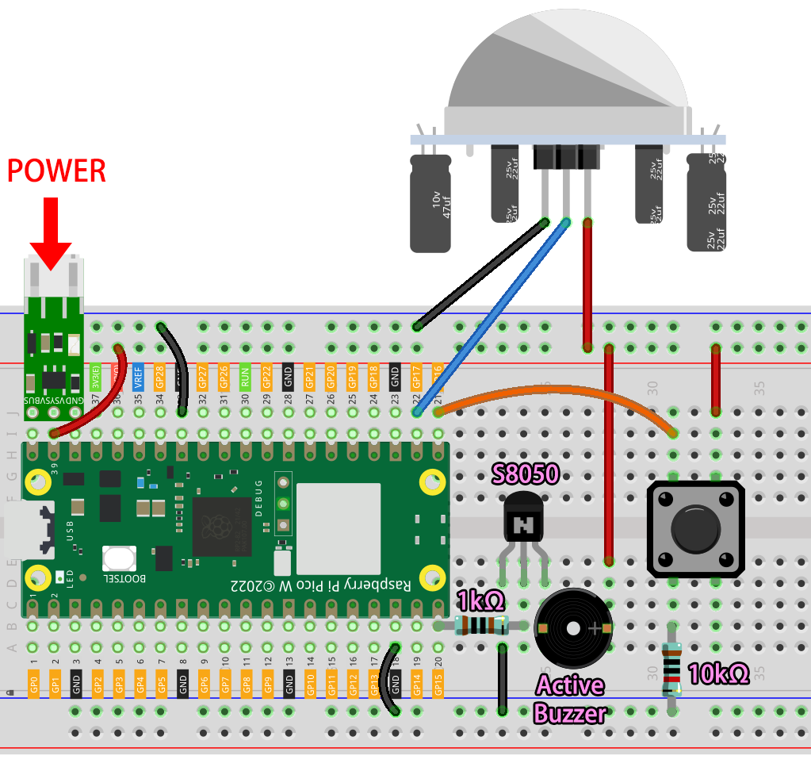

.. note::

    Bonjour, bienvenue dans la communauté SunFounder des passionnés de Raspberry Pi, Arduino & ESP32 sur Facebook ! Explorez en profondeur le Raspberry Pi, l'Arduino et l'ESP32 avec d'autres passionnés.

    **Pourquoi nous rejoindre ?**

    - **Support d'experts** : Résolvez les problèmes après-vente et les défis techniques avec l'aide de notre communauté et de notre équipe.
    - **Apprendre & Partager** : Échangez des astuces et des tutoriels pour améliorer vos compétences.
    - **Avant-premières exclusives** : Accédez en avant-première aux annonces de nouveaux produits et aux aperçus exclusifs.
    - **Réductions spéciales** : Profitez de remises exclusives sur nos nouveaux produits.
    - **Promotions festives et cadeaux** : Participez à des concours et promotions spéciales.

    👉 Prêt à explorer et créer avec nous ? Cliquez sur [|link_sf_facebook|] et rejoignez-nous dès aujourd'hui !

3. Système de Sécurité via @IFTTT
============================================

Avec ce projet, nous allons créer un dispositif de sécurité utilisant un capteur PIR pour détecter toute intrusion dans votre maison par un cambrioleur ou un animal errant. En cas de détection, vous recevrez une alerte par e-mail.

Webhook sera utilisé comme service de base.
Une requête POST est envoyée au service IFTTT depuis le Raspberry Pi Pico W.
Avec IFTTT, nous allons créer un Applet pour intercepter le webhook et envoyer un e-mail.

.. warning:: la politique tarifaire d'IFTTT a été mise à jour. L'utilisation de ce projet peut entraîner des frais supplémentaires. Veuillez en tenir compte à l'avance.

**1. Composants Requis**

Dans ce projet, nous aurons besoin des composants suivants.

Il est certainement pratique d'acheter un kit complet, voici le lien :

.. list-table::
    :widths: 20 20 20
    :header-rows: 1

    *   - Nom	
        - DANS CE KIT
        - LIEN
    *   - Kepler Kit	
        - 450+
        - |link_kepler_kit|

Vous pouvez également les acheter séparément via les liens ci-dessous.

.. list-table::
    :widths: 5 20 5 20
    :header-rows: 1

    *   - SN
        - COMPOSANT	
        - QUANTITÉ
        - LIEN

    *   - 1
        - :ref:`cpn_pico_w`
        - 1
        - |link_picow_buy|
    *   - 2
        - Câble Micro USB
        - 1
        - 
    *   - 3
        - :ref:`cpn_breadboard`
        - 1
        - |link_breadboard_buy|
    *   - 4
        - :ref:`cpn_wire`
        - Plusieurs
        - |link_wires_buy|
    *   - 5
        - :ref:`cpn_transistor`
        - 1(S8050)
        - |link_transistor_buy|
    *   - 6
        - :ref:`cpn_resistor`
        - 2(1KΩ, 10KΩ)
        - |link_resistor_buy|
    *   - 7
        - :ref:`cpn_button`
        - 1
        - |link_button_buy|
    *   - 8
        - Buzzer Actif :ref:`cpn_buzzer`
        - 1
        - 
    *   - 9
        - :ref:`cpn_lipo_charger`
        - 1
        -  
    *   - 10
        - Batterie 18650
        - 1
        -  
    *   - 11
        - Support de Batterie
        - 1
        -  
    *   - 12
        - :ref:`cpn_pir`
        - 1
        - |link_pir_buy|

**2. Construire le Circuit**

.. warning:: 
        
    Assurez-vous que votre module chargeur Li-po est connecté comme indiqué sur le schéma. Sinon, un court-circuit risque d'endommager votre batterie et votre circuit.

**3. CONFIGURER IFTTT**

IFTTT est un service gratuit qui offre diverses façons de connecter différents services de données entre eux.

Nous allons créer un Applet qui réagit à un webhook (URL personnalisée) qui envoie des données à IFTTT.
IFTTT enverra ensuite un e-mail pour vous.

Veuillez suivre les étapes ci-dessous sur IFTTT.

1. Visitez |link_ifttt| pour vous connecter ou créer un compte.

    .. image:: img/ifttt-1.png
        :width: 500

2. Cliquez sur **Create**.

    .. image:: img/ifttt-2.png
        :width: 500

3. Ajoutez un événement **If This**.

    .. image:: img/ifttt-3.png
        :width: 500

4. Recherchez **Webhooks**.

    .. image:: img/ifttt-4.png
        :width: 500

5. Appuyez sur **Receive a web request**.

    .. image:: img/ifttt-5.png
        :width: 500

6. Remplissez le nom de l'événement (par exemple, SecurityWarning), et cliquez sur **Create trigger**.

    .. image:: img/ifttt-6.png
        :width: 500

7. Ajoutez un événement **Then That**.

    .. image:: img/ifttt-7.png
        :width: 500

8. Recherchez **Email**.

    .. image:: img/ifttt-8.png
        :width: 500

9. Cliquez sur **Send me an email**.

    .. image:: img/ifttt-9.png
        :width: 500

10. Remplissez **Subject** et **Body**, puis cliquez sur **Create action**.

    .. image:: img/ifttt-10.png
        :width: 500

11. Cliquez sur **Continue** pour terminer la configuration.

    .. image:: img/ifttt-11.png
        :width: 500

12. Modifiez le titre et c'est terminé.

    .. image:: img/ifttt-12.png
        :width: 500

13. Vous serez automatiquement redirigé vers la page de détails de l'Applet, où vous pourrez voir que l'Applet est connecté et activer/désactiver son commutateur.

    .. image:: img/ifttt-13.png
        :width: 500

**4. Exécuter le Script**

#. Maintenant que nous avons créé l'Applet IFTTT, nous avons besoin de la clé API que vous pouvez obtenir depuis le |link_webhooks| pour permettre au Pico W d'accéder à IFTTT.

    .. image:: img/ifttt-14.png
        :width: 500

#. Copiez-la dans le script ``secrets.py`` sur le Raspberry Pi Pico W.

    .. image:: img/3_ifttt4.png

    .. note::

        Si vous n'avez pas les scripts ``do_connect.py`` et ``secrets.py`` dans votre Pico W, veuillez vous référer à :ref:`iot_access` pour les créer.

    .. code-block:: python
        :emphasize-lines: 4

        secrets = {
        'ssid': 'SSID',
        'password': 'PASSWORD',
        'webhooks_key':'WEBHOOKS_API_KEY'
        }

#. Ouvrez le fichier ``3_ifttt_mail.py`` dans le chemin ``kepler-kit-main/iot``, puis cliquez sur **File** -> **Save as** ou appuyez sur ``Ctrl+Shift+S``.

    .. image:: img/3_ifttt1.png

#. Sélectionnez **Raspberry Pi Pico** dans la fenêtre popup qui apparaît.

    .. image:: img/3_ifttt2.png

#. Définissez le nom de fichier sur ``main.py``. Un message apparaîtra si un fichier du même nom existe déjà sur votre Pico W.

    .. image:: img/3_ifttt3.png

#. Vous pouvez maintenant débrancher le câble USB et utiliser le module chargeur Li-po pour alimenter le Raspberry Pi Pico W. Vous entendrez un buzzer lorsque le script s'exécute. Le buzzer continuera de sonner si le module PIR détecte une personne ou une créature passant à proximité, et une alerte par e-mail vous sera envoyée. Le script peut être redémarré en appuyant sur le bouton.

**Comment ça marche ?**

Le Raspberry Pi Pico W doit être connecté à Internet, comme décrit dans :ref:`iot_access`. Pour ce projet, utilisez simplement :

.. code-block:: python

    from do_connect import *
    do_connect()

Le capteur PIR lit les données et appelle la fonction ``motion_detected()`` s'il détecte quelqu'un passant (passage de données de 0 à 1).

.. code-block:: python

    import machine

    sensor=machine.Pin(17,machine.Pin.IN)

    sensor.irq(trigger=machine.Pin.IRQ_RISING, handler=motion_detected)

Ensuite, le Pico W envoie les données à IFTTT. Comme vous pouvez le voir, le ``message`` envoyé à IFTTT est une chaîne d'URL.
IFTTT identifie l'expéditeur via ``secrets['webhooks_key']``, et l'événement déclenché est identifié par ``event``.
Assurez-vous qu'ils soient corrects.

.. code-block:: python

    import urequests
    from secrets import *

    event='SecurityWarning'
    message=f"https://maker.ifttt.com/trigger/{event}/with/key/{secrets['webhooks_key']}"

    def motion_detected(pin):
        urequests.post(message)
        print(message)
        global warn_flag
        warn_flag=True
        sensor.irq(handler=None)

Quand ``motion_detected()`` est appelé, la variable ``warn_flag`` est définie sur ``True``, ce qui fait que le buzzer continue de sonner.

.. code-block:: python

    while True:
        if warn_flag==True:
            alarm.toggle()
            time.sleep_ms(50)

Le bouton sert à redémarrer le script.

.. code-block:: python

    button=machine.Pin(16,machine.Pin.IN)

    def reset_device(pin):
        machine.reset()

    button.irq(trigger=machine.Pin.IRQ_RISING, handler=reset_device)
