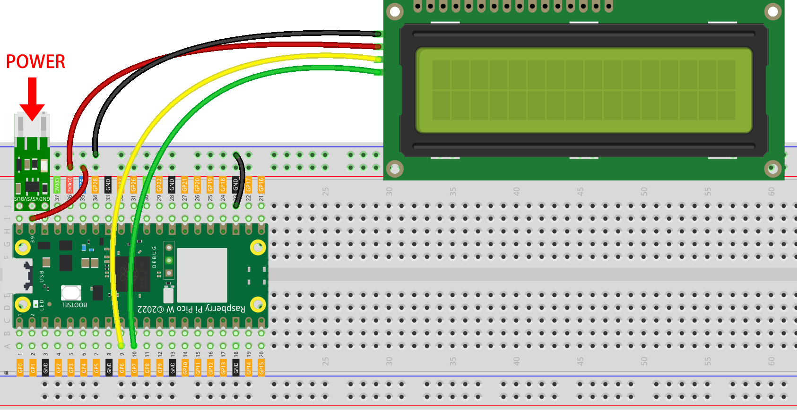

.. note::

    Bonjour, bienvenue dans la communauté SunFounder des passionnés de Raspberry Pi, Arduino & ESP32 sur Facebook ! Plongez au cœur des projets avec Raspberry Pi, Arduino et ESP32 avec d'autres passionnés.

    **Pourquoi nous rejoindre ?**

    - **Support d'experts** : Résolvez les problèmes après-vente et les défis techniques avec l'aide de notre communauté et de notre équipe.
    - **Apprendre & Partager** : Échangez des astuces et des tutoriels pour améliorer vos compétences.
    - **Avant-premières exclusives** : Recevez en avant-première des annonces de nouveaux produits et des aperçus exclusifs.
    - **Réductions spéciales** : Profitez de réductions exclusives sur nos nouveaux produits.
    - **Promotions festives et concours** : Participez à des concours et des promotions spéciales.

    👉 Prêt à explorer et créer avec nous ? Cliquez sur [|link_sf_facebook|] et rejoignez-nous dès aujourd'hui !

4. Météo en Temps Réel via @OpenWeatherMap 
===========================================

Ce projet consiste à créer une horloge intelligente qui affiche la météo de votre ville ainsi que l'heure sur un écran LCD.

**1. Composants Requis**

Dans ce projet, nous aurons besoin des composants suivants.

Il est certainement pratique d'acheter un kit complet, voici le lien : 

.. list-table::
    :widths: 20 20 20
    :header-rows: 1

    *   - Nom	
        - DANS CE KIT
        - LIEN
    *   - Kepler Kit	
        - 450+
        - |link_kepler_kit|

Vous pouvez également les acheter séparément via les liens ci-dessous.

.. list-table::
    :widths: 5 20 5 20
    :header-rows: 1

    *   - SN
        - COMPOSANT	
        - QUANTITÉ
        - LIEN

    *   - 1
        - :ref:`cpn_pico_w`
        - 1
        - |link_picow_buy|
    *   - 2
        - Câble Micro USB
        - 1
        - 
    *   - 3
        - :ref:`cpn_breadboard`
        - 1
        - |link_breadboard_buy|
    *   - 4
        - :ref:`cpn_wire`
        - Plusieurs
        - |link_wires_buy|
    *   - 5
        - :ref:`cpn_i2c_lcd`
        - 1
        - |link_i2clcd1602_buy|
    *   - 6
        - :ref:`cpn_lipo_charger`
        - 1
        -  
    *   - 7
        - Power Pack
        - 1
        -  
    *   - 8
        - Support de Batterie
        - 1
        -  

**2. Construire le Circuit**

    .. warning:: 
        
        Assurez-vous que votre module chargeur Li-po est connecté comme indiqué sur le schéma. Sinon, un court-circuit risque d'endommager votre batterie et votre circuit.

**3. Obtenez les Clés API OpenWeather**

|link_openweather| est un service en ligne, propriété de OpenWeather Ltd, qui fournit des données météorologiques globales via une API, incluant les données météorologiques actuelles, les prévisions, les nowcasts et les données météorologiques historiques pour toute localisation géographique.

#. Visitez |link_openweather| pour vous connecter/créer un compte.

    .. image:: img/OWM-1.png

#. Cliquez sur la page API depuis la barre de navigation.

    .. image:: img/OWM-2.png

#. Trouvez **Current Weather Data** et cliquez sur Subscribe.

    .. image:: img/OWM-3.png

#. Sous **Current weather and forecasts collection**, abonnez-vous au service approprié. Pour notre projet, l'offre gratuite est suffisante.

   .. image:: img/OWM-4.png

#. Copiez la clé depuis la page **API keys**.

   .. image:: img/OWM-5.png

#. Copiez-la dans le script ``secrets.py`` sur le Raspberry Pi Pico W.

    .. image:: img/4_openweather1.png

    .. note::

        Si vous n'avez pas les scripts ``do_connect.py`` et ``secrets.py`` dans votre Pico W, veuillez vous référer à :ref:`iot_access` pour les créer.

    .. code-block:: python
        :emphasize-lines: 5

        secrets = {
        'ssid': 'SSID',
        'password': 'PASSWORD',
        'webhooks_key':'WEBHOOKS_API_KEY',
        'openweather_api_key':'OPENWEATHERMAP_API_KEY'
        }

**4. Exécution du Script**

#. Ouvrez le fichier ``4_weather.py`` dans le répertoire ``kepler-kit-main/iot``, cliquez sur le bouton **Exécuter le script actuel** ou appuyez sur F5 pour le lancer.

    .. image:: img/4_openweather2.png

#. Une fois le script exécuté, vous verrez l'heure et les informations météorologiques de votre emplacement sur l'écran I2C LCD1602.

    .. note:: 

        Lorsque le code est en cours d'exécution, si l'écran reste vide, vous pouvez ajuster le potentiomètre situé à l'arrière du module pour augmenter le contraste.

#. Si vous souhaitez que ce script soit lancé au démarrage, vous pouvez l'enregistrer dans le Raspberry Pi Pico W sous le nom de ``main.py``.

**Comment ça marche ?**

Le Raspberry Pi Pico W doit être connecté à Internet, comme décrit dans la section :ref:`iot_access`. Utilisez simplement cette connexion pour ce projet.

.. code-block:: python

    from do_connect import *
    do_connect()

Après la connexion à Internet, ces quelques lignes de code permettent de synchroniser votre Pico W à l'heure du méridien de Greenwich (GMT).

.. code-block:: python

   import ntptime
   while True:
      try:
         ntptime.settime()
         print('Time Set Successfully')
         break
      except OSError:
         print('Time Setting...')
         continue   

Initialisez votre écran LCD, référez-vous à :ref:`py_lcd` pour les détails d'utilisation.

.. code-block:: python

   from lcd1602 import LCD
   lcd=LCD()
   lcd.clear() 
   string = 'Loading...'
   lcd.message(string)

Nous devons sélectionner l'unité de certaines données météorologiques (par exemple, la température, la vitesse du vent) avant de récupérer les informations météorologiques. Dans ce cas, l'unité est ``métrique``.

.. code-block:: python

   # Open Weather
   TEMPERATURE_UNITS = {
      "standard": "K",
      "metric": "°C",
      "imperial": "°F",
   }

   SPEED_UNITS = {
      "standard": "m/s",
      "metric": "m/s",
      "imperial": "mph",
   }

   units = "metric"

Ensuite, cette fonction récupère les données météorologiques depuis ``openweathermap.org``.
Nous envoyons un message URL avec votre ville, vos clés API et une unité de mesure définie.
En retour, vous recevrez un fichier ``JSON`` avec les informations météorologiques.

.. code-block:: python

   def get_weather(city, api_key, units='metric', lang='en'):
      '''
      Get weather data from openweathermap.org
         city: City name, state code and country code divided by comma, Please, refer to ISO 3166 for the state codes or country codes. https://www.iso.org/obp/ui/#search
         api_key: Your unique API key (you can always find it on your openweather account page under the "API key" tab https://home.openweathermap.org/api_keys)
         unit: Units of measurement. standard, metric and imperial units are available. If you do not use the units parameter, standard units will be applied by default. More: https://openweathermap.org/current#data
         lang: You can use this parameter to get the output in your language. More: https://openweathermap.org/current#multi
      '''
      url = f"https://api.openweathermap.org/data/2.5/weather?q={city}&appid={api_key}&units={units}&lang={lang}"
      print(url)
      res = urequests.post(url)
      return res.json()

Si vous imprimez cet ensemble de données brutes, vous verrez des informations similaires à ce qui est montré ci-dessous.

.. code-block:: python

   Exemple de données météo :
   {
       'timezone': 28800,
       'sys': {
           'type': 2,
           'sunrise': 1659650200,
           'country': 'CN',
           'id': 2031340,
           'sunset': 1659697371
       },
       'base': 'stations',
       'main': {
           'pressure': 1008,
           'feels_like': 304.73,
           'temp_max': 301.01,
           'temp': 300.4,
           'temp_min': 299.38,
           'humidity': 91,
           'sea_level': 1008,
           'grnd_level': 1006
       },
       'visibility': 10000,
       'id': 1795565,
       'clouds': {
           'all': 96
       }, 
       'coord': {
           'lon': 114.0683,
           'lat': 22.5455
       },
       'name': 'Shenzhen',
       'cod': 200,
       'weather':[{
           'id': 804,
           'icon': '04d',
           'main': 'Clouds',
           'description': 'overcast clouds'
       }],
       'dt': 1659663579,
       'wind': {
           'gust': 7.06,
           'speed': 3.69,
           'deg': 146
       }
   }

Nous avons utilisé la fonction ``print_weather(weather_data)`` pour convertir ces données brutes en un format plus lisible et les afficher.

Mais cette fonction n'est pas encore appelée, vous pouvez décommenter cette ligne dans la boucle ``while True`` selon vos besoins.

.. image:: img/4_openweather3.png

.. code-block:: python
   :emphasize-lines: 2

   # affichage shell
   print_weather(weather_data)

Dans la boucle ``while True``, la fonction ``get_weather()`` est appelée en premier pour récupérer les informations de ``météo``, ``température`` et ``humidité`` nécessaires à ce projet.

.. code-block:: python

   weather_data = get_weather('shenzhen', secrets['openweather_api_key'], units=units)
   weather=weather_data["weather"][0]["main"]
   t=weather_data["main"]["temp"]
   rh=weather_data["main"]["humidity"]

Obtenez l'heure locale. La fonction ``time.localtime()`` est appelée ici pour retourner un ensemble de tuples (année, mois, jour, heure, minute, seconde, jour de la semaine, jour de l'année). Nous avons extrait ``heure`` et ``minute``.

Notez que nous avons déjà synchronisé Pico W à l'heure GMT, donc nous devons ajouter le fuseau horaire de votre emplacement.

.. code-block:: python
    
    # obtenir l'heure (+24 pour l'hémisphère ouest)
    # si négatif, ajouter 24
    # heures = time.localtime()[3] + int(weather_data["timezone"] / 3600) + 24  # seulement pour l'hémisphère ouest

    hours=time.localtime()[3]+int(weather_data["timezone"] / 3600)
    mins=time.localtime()[4]

Enfin, les informations météorologiques et l'heure sont simplement affichées sur le LCD1602.

.. code-block:: python

   lcd.clear() 
   time.sleep_ms(200)
   string = f'{hours:02d}:{mins:02d} {weather}\n'
   lcd.message(string)
   string = f'{t}{TEMPERATURE_UNITS[units]} {rh}%rh'
   lcd.message(string)

Votre écran LCD1602 deviendra une horloge qui se met à jour toutes les 30 secondes, lorsque la boucle principale s'exécute toutes les 30 secondes.

.. OPW的文档页面, 可以查找每种产品的所有技术信息。https://openweathermap.org/api

.. 查看获取到的key https://home.openweathermap.org/api_keys
.. 当前天气的资料页 https://openweathermap.org/current
.. https://openweathermap.org/appid