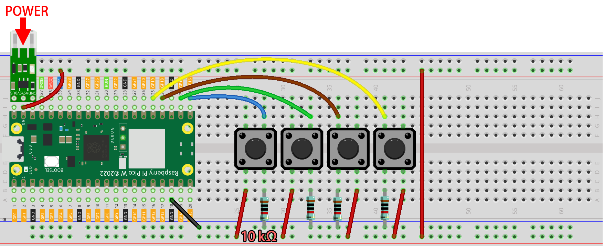

.. note::

    Bonjour et bienvenue dans la communauté SunFounder Raspberry Pi & Arduino & ESP32 Enthusiasts sur Facebook ! Plongez plus profondément dans le Raspberry Pi, Arduino et ESP32 avec d'autres passionnés.

    **Pourquoi nous rejoindre ?**

    - **Support d'experts** : Résolvez les problèmes après-vente et les défis techniques avec l'aide de notre communauté et de notre équipe.
    - **Apprenez & partagez** : Échangez des astuces et des tutoriels pour améliorer vos compétences.
    - **Aperçus exclusifs** : Accédez en avant-première aux annonces de nouveaux produits.
    - **Réductions spéciales** : Profitez de réductions exclusives sur nos derniers produits.
    - **Promotions festives et cadeaux** : Participez à des tirages au sort et à des promotions de vacances.

    👉 Prêt à explorer et créer avec nous ? Cliquez sur [|link_sf_facebook|] et rejoignez-nous dès aujourd'hui !

.. _nt_mqtt_publish:

5. Système d'Appel avec @MQTT
============================================

Le Message Queuing Telemetry Transport (MQTT) est un protocole de messagerie simple.
C'est également le protocole de messagerie le plus courant pour l'Internet des Objets (IoT).

Les protocoles MQTT définissent la manière dont les dispositifs IoT transfèrent les données.
Ils sont pilotés par événements et interconnectés via le modèle Pub/Sub.
L'expéditeur (Publisher) et le récepteur (Subscriber) communiquent via des Topics.
Un appareil publie un message sur un sujet spécifique, et tous les appareils abonnés à ce sujet reçoivent le message.

Dans cette section, nous allons créer un système de sonnette de service en utilisant Pico W, HiveMQ (un service gratuit de courtier MQTT public), et quatre boutons.
Les quatre boutons représentent quatre tables dans un restaurant, et vous pourrez voir sur HiveMQ quelle table a besoin de service lorsque le client appuie sur le bouton.

**1. Composants nécessaires**

Dans ce projet, nous aurons besoin des composants suivants. 

Il est évidemment plus pratique d'acheter un kit complet, voici le lien :

.. list-table::
    :widths: 20 20 20
    :header-rows: 1

    *   - Nom	
        - ÉLÉMENTS DANS LE KIT
        - LIEN
    *   - Kepler Kit	
        - 450+
        - |link_kepler_kit|

Vous pouvez également les acheter séparément via les liens ci-dessous.

.. list-table::
    :widths: 5 20 5 20
    :header-rows: 1

    *   - SN
        - COMPOSANT	
        - QUANTITÉ
        - LIEN

    *   - 1
        - :ref:`cpn_pico_w`
        - 1
        - |link_picow_buy|
    *   - 2
        - Câble Micro USB
        - 1
        - 
    *   - 3
        - :ref:`cpn_breadboard`
        - 1
        - |link_breadboard_buy|
    *   - 4
        - :ref:`cpn_wire`
        - Plusieurs
        - |link_wires_buy|
    *   - 5
        - :ref:`cpn_resistor`
        - 4(10KΩ)
        - |link_resistor_buy|
    *   - 6
        - :ref:`cpn_button`
        - 4
        - |link_button_buy|
    *   - 7
        - :ref:`cpn_lipo_charger`
        - 1
        -  
    *   - 8
        - Power Pack
        - 1
        -  
    *   - 9
        - Support de Batterie
        - 1
        -  

**2. Monter le Circuit**

    .. warning:: 
        
        Assurez-vous que votre module de chargeur Li-po est connecté comme indiqué sur le schéma. Sinon, un court-circuit pourrait endommager votre batterie et votre circuit.

**3. Visiter HiveMQ**

HiveMQ est une plateforme de messagerie basée sur MQTT qui permet un transfert de données rapide, efficace et fiable vers les dispositifs IoT.

1. Ouvrez |link_hivemq| dans votre navigateur.

2. Connectez le client au proxy public par défaut.

   .. image:: img/mqtt-1.png

3. Cliquez sur **Ajouter une nouvelle souscription à un sujet**.

   .. image:: img/mqtt-2.png

4. Remplissez les sujets que vous souhaitez suivre et cliquez sur **S'abonner**. Les sujets définis ici doivent être plus personnels pour éviter de recevoir des messages d'autres utilisateurs, et faites attention à la sensibilité à la casse.

   .. image:: img/mqtt-3.png

**4. Installer le Module MQTT**

Avant de commencer le projet, nous devons installer le module MQTT pour Pico W.

1. Connectez-vous au réseau en exécutant ``do_connect()`` dans le Shell, que nous avons écrit précédemment.

    .. note::
        * Tapez les commandes suivantes dans le Shell et appuyez sur ``Entrée`` pour les exécuter.
        * Si vous n'avez pas les scripts ``do_connect.py`` et ``secrets.py`` dans votre Pico W, veuillez vous référer à :ref:`iot_access` pour les créer.

    .. code-block:: python

        from do_connect import *
        do_connect()

2. Après une connexion réseau réussie, importez le module ``mip`` dans le shell et utilisez ``mip`` pour installer le module ``umqtt.simple``, un client MQTT simplifié pour MicroPython.

    .. code-block:: python

        import mip
        mip.install('umqtt.simple')

3. Vous verrez que le module ``umqtt`` est installé sous le chemin ``/lib/`` du Pico W après la fin de l'installation.

    .. image:: img/5_calling_system1.png

**5. Exécuter le Script**

#. Ouvrez le fichier ``5_mqtt_publish.py`` dans le répertoire ``kepler-kit-main/iot``.

#. Cliquez sur le bouton **Exécuter le script actuel** ou appuyez sur F5 pour le lancer.

    .. image:: img/5_calling_system2.png

#. Retournez à |link_hivemq| et lorsque vous appuyez sur l'un des boutons de la plaque de prototypage, vous verrez une notification de message sur HiveMQ.

    .. image:: img/mqtt-4.png

#. Si vous souhaitez que ce script soit lancé au démarrage, vous pouvez l'enregistrer sur le Raspberry Pi Pico W sous le nom de ``main.py``.

**Comment ça marche ?**

Le Raspberry Pi Pico W doit être connecté à Internet, comme décrit dans :ref:`iot_access`. Utilisez simplement cette connexion pour ce projet.

.. code-block:: python

    from do_connect import *
    do_connect()

Initialisez 4 broches pour les boutons.

.. code-block:: python

    sensor1 = Pin(16, Pin.IN)
    sensor2 = Pin(17, Pin.IN)
    sensor3 = Pin(18, Pin.IN)
    sensor4 = Pin(19, Pin.IN)

Créez deux variables pour stocker l'``URL`` et l'``ID client`` du courtier MQTT avec lequel nous allons nous connecter.
Étant donné que nous utilisons un courtier public, notre ``ID client`` ne sera pas utilisé, même si un est requis.

.. code-block:: python

    mqtt_server = 'broker.hivemq.com'
    client_id = 'Jimmy'

Connectez-vous au courtier MQTT et maintenez la connexion pendant une heure. En cas d'échec, réinitialisez le Pico W.

.. code-block:: python

    try:
        client = MQTTClient(client_id, mqtt_server, keepalive=3600)
        client.connect()
        print('Connected to %s MQTT Broker'%(mqtt_server))
    except OSError as e:
        print('Failed to connect to the MQTT Broker. Reconnecting...')
        time.sleep(5)
        machine.reset()

Créez une variable ``topic``, qui est le sujet que l'abonné doit suivre. Elle doit correspondre au sujet défini à l'étape **4** de la section **2. Visiter HiveMQ** ci-dessus.
Par ailleurs, ``b`` ici convertit la chaîne en octet, car MQTT est un protocole binaire où les éléments de contrôle sont des octets binaires et non des chaînes de texte.

.. code-block:: python

    topic = b'SunFounder MQTT Test'

Définissez des interruptions pour chaque bouton. Lorsqu'un bouton est pressé, un message est publié sous le ``topic``.

.. code-block:: python

    def press1(pin):
        message = b'button 1 is pressed'
        client.publish(topic, message)
        print(message)

    sensor1.irq(trigger=machine.Pin.IRQ_RISING, handler=press1)

* `UMQTT Client API  <https://pypi.org/project/micropython-umqtt.simple/>`_

.. https://www.tomshardware.com/how-to/send-and-receive-data-raspberry-pi-pico-w-mqtt