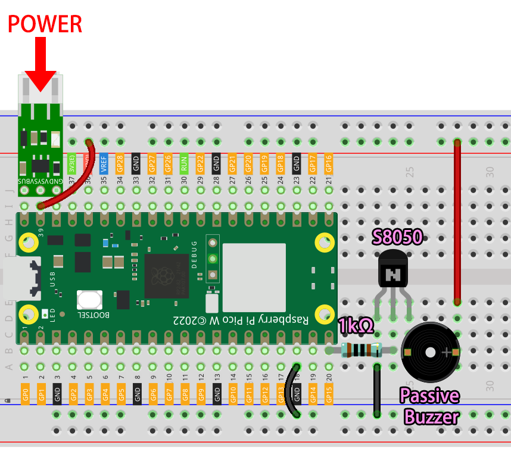

.. note::

    Bonjour et bienvenue dans la communauté SunFounder Raspberry Pi & Arduino & ESP32 Enthusiasts sur Facebook ! Plongez plus profondément dans le Raspberry Pi, Arduino et ESP32 avec d'autres passionnés.

    **Pourquoi nous rejoindre ?**

    - **Support d'experts** : Résolvez les problèmes après-vente et les défis techniques avec l'aide de notre communauté et de notre équipe.
    - **Apprenez & partagez** : Échangez des astuces et des tutoriels pour améliorer vos compétences.
    - **Aperçus exclusifs** : Accédez en avant-première aux annonces de nouveaux produits.
    - **Réductions spéciales** : Profitez de réductions exclusives sur nos derniers produits.
    - **Promotions festives et cadeaux** : Participez à des tirages au sort et à des promotions de vacances.

    👉 Prêt à explorer et créer avec nous ? Cliquez sur [|link_sf_facebook|] et rejoignez-nous dès aujourd'hui !

.. _nt_mqtt_Subscribe:

6. Lecteur Cloud avec @MQTT
=========================================

Il est recommandé de réaliser d'abord le projet :ref:`nt_mqtt_publish` pour installer certains modules et configurer la plateforme HiveMQ.

Dans ce projet, le Pico W agira comme un abonné et recevra le nom de la chanson sous le sujet défini.
Si le nom de la chanson est déjà dans le code, le Pico W fera jouer la chanson via le buzzer.

**1. Composants nécessaires**

Dans ce projet, nous aurons besoin des composants suivants. 

Il est évidemment plus pratique d'acheter un kit complet, voici le lien :

.. list-table::
    :widths: 20 20 20
    :header-rows: 1

    *   - Nom	
        - ÉLÉMENTS DANS LE KIT
        - LIEN
    *   - Kepler Kit	
        - 450+
        - |link_kepler_kit|

Vous pouvez également les acheter séparément via les liens ci-dessous.

.. list-table::
    :widths: 5 20 5 20
    :header-rows: 1

    *   - SN
        - COMPOSANT	
        - QUANTITÉ
        - LIEN

    *   - 1
        - :ref:`cpn_pico_w`
        - 1
        - |link_picow_buy|
    *   - 2
        - Câble Micro USB
        - 1
        - 
    *   - 3
        - :ref:`cpn_breadboard`
        - 1
        - |link_breadboard_buy|
    *   - 4
        - :ref:`cpn_wire`
        - Plusieurs
        - |link_wires_buy|
    *   - 5
        - :ref:`cpn_transistor`
        - 1(S8050)
        - |link_transistor_buy|
    *   - 6
        - :ref:`cpn_resistor`
        - 1(1KΩ)
        - |link_resistor_buy|
    *   - 7
        - Buzzer passif :ref:`cpn_buzzer`
        - 1
        - |link_passive_buzzer_buy|
    *   - 8
        - :ref:`cpn_lipo_charger`
        - 1
        -  
    *   - 9
        - Power Pack
        - 1
        -  
    *   - 10
        - Support de Batterie
        - 1
        -  

**2. Monter le Circuit**

Le kit comprend deux buzzers. Nous utilisons ici un buzzer passif (celui avec un PCB exposé à l'arrière). Le buzzer nécessite un transistor pour fonctionner, et nous utilisons un S8050.

    .. warning:: 
        
        Assurez-vous que votre module de chargeur Li-po est connecté comme indiqué sur le schéma. Sinon, un court-circuit pourrait endommager votre batterie et votre circuit.

**3. Exécuter le Code**

#. Téléchargez le fichier ``play_music.py`` sous le chemin ``kepler-kit-main/iot`` vers le Raspberry Pi Pico W.

    .. image:: img/mqtt-A-1.png

#. Ouvrez le fichier ``6_mqtt_subscribe_music.py`` dans le répertoire ``kepler-kit-main/iot`` et cliquez sur le bouton **Exécuter le script actuel** ou appuyez sur F5 pour l'exécuter.

    .. image:: img/6_cloud_player.png

    .. note::
        Avant de lancer le code, assurez-vous d'avoir les scripts ``do_connect.py`` et ``secrets.py`` dans votre Pico W. Sinon, veuillez vous référer à :ref:`iot_access` pour les créer.

#. Ouvrez |link_hivemq| dans votre navigateur, remplissez le Topic avec ``SunFounder MQTT Music``, et le nom de la chanson comme **Message**. Après avoir cliqué sur le bouton **Publier**, le buzzer connecté au Pico W jouera la chanson correspondante.

    .. note::
        Les chansons incluses dans ``play_music.py`` sont ``nokia``, ``starwars``, ``nevergonnagiveyouup``, ``gameofthrone``, ``songofstorms``, ``zeldatheme``, ``harrypotter``.

    .. image:: img/mqtt-5.png
        :width: 500

#. Si vous souhaitez que ce script se lance au démarrage, vous pouvez l'enregistrer sur le Raspberry Pi Pico W sous le nom ``main.py``.

**Comment ça fonctionne ?**

Pour simplifier la compréhension, nous avons séparé le code MQTT du reste. Le résultat est le code suivant, qui implémente les fonctionnalités de base des abonnements MQTT en trois étapes.

.. code-block:: python
    :emphasize-lines: 13,14,15,16,20,28,29,30

    import time
    from umqtt.simple import MQTTClient

    from do_connect import *
    do_connect()

    mqtt_server = 'broker.hivemq.com'
    client_id = 'Jimmy'

    # pour s'abonner au message
    topic = b'SunFounder MQTT Music'

    def callback(topic, message):
        print("New message on topic {}".format(topic.decode('utf-8')))
        message = message.decode('utf-8')
        print(message)

    try:
        client = MQTTClient(client_id, mqtt_server, keepalive=60)
        client.set_callback(callback)
        client.connect()
        print('Connected to %s MQTT Broker'%(mqtt_server))
    except OSError as e:
        print('Failed to connect to MQTT Broker. Reconnecting...')
        time.sleep(5)
        machine.reset()
        
    while True:
        client.subscribe(topic)
        time.sleep(1)

Lors de la connexion au broker MQTT, nous appelons la fonction ``client.set_callback(callback)``, qui sert de rappel pour les messages reçus via les abonnements.

.. code-block:: python
    :emphasize-lines: 3

    try:
        client = MQTTClient(client_id, mqtt_server, keepalive=60)
        client.set_callback(callback)
        client.connect()
        print('Connected to %s MQTT Broker'%(mqtt_server))
    except OSError as e:
        print('Failed to connect to MQTT Broker. Reconnecting...')
        time.sleep(5)
        machine.reset()

Ensuite, la fonction de rappel affiche le message reçu du topic. 
MQTT est un protocole binaire où les éléments de contrôle sont des octets binaires et non des chaînes de texte, donc ces messages doivent être décodés avec ``message.decode('utf-8')``.

.. code-block:: python

    def callback(topic, message):
        print("New message on topic {}".format(topic.decode('utf-8')))
        message = message.decode('utf-8')
        print(message)

Utilisez une boucle ``While True`` pour obtenir régulièrement des messages sur ce topic.

.. code-block:: python

    while True:
        client.subscribe(topic)
        time.sleep(1)

Ensuite, la musique sera jouée. Cette fonction se trouve dans le script ``play_music.py`` et se compose de trois parties principales.

* ``Tone`` : Simule un ton spécifique basé sur la fréquence fondamentale |link_piano_frequency|, utilisée pour jouer la note.

    .. code-block:: python

        NOTE_B0 =  31
        NOTE_C1 =  33
        ...
        NOTE_DS8 = 4978
        REST =      0

* ``Score`` : Éditez la musique dans un format que le programme peut utiliser. Ces partitions proviennent du `partage libre de Robson Couto <https://github.com/robsoncouto/arduino-songs>`_, vous pouvez également ajouter vos morceaux préférés dans le format suivant.

    .. code-block:: python

        # notes de la mélodie suivies de la durée.
        # un 4 signifie une noire, un 8 une croche, un 16 une double croche, etc.
        # !!les nombres négatifs représentent des notes pointées, 
        # donc -4 signifie une noire pointée, soit une noire plus une croche !!
        song = {
            "nokia":[NOTE_E5, 8, NOTE_D5, 8, NOTE_FS4, 4, NOTE_GS4, 4, NOTE_CS5, 8, NOTE_B4, 8, NOTE_D4, 4, 
                        NOTE_E4, 4,NOTE_B4, 8, NOTE_A4, 8, NOTE_CS4, 4, NOTE_E4, 4, NOTE_A4, 2],
            "starwars":[,,,],
            "nevergonnagiveyouup":[,,,],
            "gameofthrone":[,,,],
            "songofstorms":[,,,],
            "zeldatheme":[,,,],
            "harrypotter":[,,,],
        }

* ``Play`` : Cette partie est essentiellement la même que :ref:`py_pa_buz`, mais légèrement optimisée pour s'adapter aux partitions ci-dessus.

    .. code-block:: python

       import time
       import machine

       # changez cette valeur pour rendre la chanson plus lente ou plus rapide
       tempo = 220

       # ceci calcule la durée d'une ronde en ms
       wholenote = (60000 * 4) / tempo

       def tone(pin,frequency,duration):
           if frequency is 0:
               pass
           else:
               pin.freq(frequency)
               pin.duty_u16(30000)
           time.sleep_ms(duration)
           pin.duty_u16(0)

       def noTone(pin):
           tone(pin,0,100)

       def play(pin,melody):

           # itérez sur les notes de la mélodie.
           # Rappel, le tableau contient deux fois le nombre de notes (notes + durées)
           for thisNote in range(0,len(melody),2):
               # calculez la durée de chaque note
               divider = melody[thisNote+1]
               if divider > 0:
                   noteDuration = wholenote/divider
               elif divider < 0:
                   noteDuration = wholenote/-(divider)
                   noteDuration *= 1.5

               # nous ne jouons la note que pour 90% de sa durée, laissant 10% comme pause
               tone(pin,melody[thisNote],int(noteDuration*0.9))

               # Attendez la durée spécifiée avant de jouer la note suivante.
               time.sleep_ms(int(noteDuration))

               # arrêtez la génération d'onde avant la note suivante.
               noTone(pin)

Retournez à la fonction principale et laissez MQTT déclencher la lecture de la musique.
Dans la fonction de rappel, déterminez si le message envoyé correspond au nom d'une chanson incluse.
Si c'est le cas, assignez le nom de la chanson à la variable ``melody`` et définissez ``play_flag`` sur ``True``.

.. code-block:: python
    :emphasize-lines: 5,6,7,8

    def callback(topic, message):
        print("New message on topic {}".format(topic.decode('utf-8')))
        message = message.decode('utf-8')
        print(message)
        if message in song.keys():
            global melody,play_flag
            melody = song[message]
            play_flag = True

Dans la boucle principale, si ``play_flag`` est ``True``, jouez ``melody``.

.. code-block:: python
    :emphasize-lines: 4,5,6

    while True:
        client.subscribe(topic)
        time.sleep(1)
        if play_flag is True:
            play(buzzer,melody)
            play_flag = False