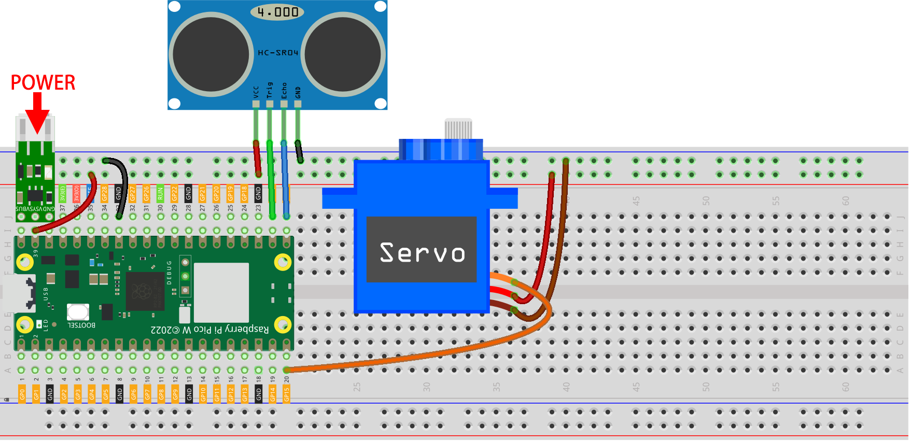

.. note:: 

    ¡Hola! Bienvenido a la Comunidad de Entusiastas de SunFounder para Raspberry Pi, Arduino y ESP32 en Facebook. Explora a fondo Raspberry Pi, Arduino y ESP32 con otros entusiastas.

    **¿Por qué unirse?**

    - **Soporte experto**: Resuelve problemas técnicos y consultas postventa con la ayuda de nuestra comunidad y equipo.
    - **Aprende y comparte**: Intercambia consejos y tutoriales para mejorar tus habilidades.
    - **Vista previa exclusiva**: Obtén acceso anticipado a anuncios de nuevos productos y adelantos exclusivos.
    - **Descuentos especiales**: Disfruta de descuentos exclusivos en nuestros productos más recientes.
    - **Promociones y sorteos especiales**: Participa en sorteos y promociones de temporada.

    👉 ¿Listo para explorar y crear con nosotros? Haz clic en [|link_sf_facebook|] y únete hoy mismo.

.. _play_sc:

9. Controla con la App de SunFounder
========================================

En este proyecto, aprenderás cómo construir un proyecto de control remoto usando la aplicación SunFounder Controller.
En un entorno LAN, podrás controlar tu circuito Pico W desde tu teléfono o tablet.
Encontrarás esta aplicación muy útil si deseas construir un robot simple con el Pico W.

Aquí, utilizaremos la barra deslizante de la APP para controlar el ángulo del servo y el medidor para mostrar la distancia detectada por el sensor ultrasónico.

**1. Componentes necesarios**

Para este proyecto, necesitamos los siguientes componentes.

Es conveniente comprar un kit completo, aquí tienes el enlace:

.. list-table::
    :widths: 20 20 20
    :header-rows: 1

    *   - Nombre
        - ELEMENTOS EN ESTE KIT
        - ENLACE
    *   - Kit Kepler
        - 450+
        - |link_kepler_kit|

También puedes comprarlos por separado a través de los enlaces a continuación.

.. list-table::
    :widths: 5 20 5 20
    :header-rows: 1

    *   - N°
        - COMPONENTE
        - CANTIDAD
        - ENLACE

    *   - 1
        - :ref:`cpn_pico_w`
        - 1
        - |link_picow_buy|
    *   - 2
        - Cable Micro USB
        - 1
        - 
    *   - 3
        - :ref:`cpn_breadboard`
        - 1
        - |link_breadboard_buy|
    *   - 4
        - :ref:`cpn_wire`
        - Varios
        - |link_wires_buy|
    *   - 5
        - :ref:`cpn_servo`
        - 1
        - |link_servo_buy|
    *   - 6
        - :ref:`cpn_ultrasonic`
        - 1
        - |link_ultrasonic_buy|
    *   - 7
        - :ref:`cpn_lipo_charger`
        - 1
        -  
    *   - 8
        - Power Pack
        - 1
        -  
    *   - 9
        - Soporte de batería
        - 1
        -  

**2. Arma el circuito**

.. warning:: 
        
    Asegúrate de que tu Módulo Cargador Li-po esté conectado como se muestra en el diagrama. De lo contrario, un cortocircuito podría dañar tu batería y los componentes.

**3. Configura el SunFounder Controller**

1. Instala la `SunFounder Controller APP <https://docs.sunfounder.com/projects/sf-controller/en/latest/>`_ desde la **App Store (iOS)** o **Google Play (Android)**.

2. Abre la App y haz clic en el botón **+** en la página de inicio para crear un controlador.

    .. image:: img/sc-a-2.jpg
        :width: 800

3. Aquí elegimos **En Blanco** y **Control Dual Stick**.

    .. image:: img/sc-a-3.jpg
        :width: 800

4. Ahora obtenemos un controlador vacío.

    .. image:: img/sc-a-4.jpg
        :width: 800

5. Haz clic en el área **H** y añade un widget **Slider** (deslizador).

    .. image:: img/sc-a-5.jpg
        :width: 800

6. Haz clic en el engranaje del control para abrir la ventana de configuración.

    .. image:: img/sc-a-6.png
        :width: 300

7. Configura el Máximo en 180 y el Mínimo en 0, luego haz clic en **Confirmar**.

    .. image:: img/sc-a-7.jpg
        :width: 800

8. Haz clic en el área L y añade un widget Medidor (Gauge).

    .. image:: img/sc-a-8.jpg
        :width: 800

9. Haz clic en el engranaje del Medidor, abre la ventana de configuración, establece el Máximo en 100, el Mínimo en 0, y la unidad en cm.

    .. image:: img/sc-a-9.jpg
        :width: 800

10. Después de terminar la configuración de los widgets, haz clic en Guardar.

    .. image:: img/sc-a-10.png
        :width: 300

**4. Ejecuta el Código**

.. note:: 
    Si tu Pico W está usando actualmente el firmware de Anvil, entonces necesitarás :ref:`install_micropython_on_pico`.

1. Sube los archivos ``ws.py`` y ``websocket_helper.py`` desde la ruta ``kepler-kit-main/libs`` al Raspberry Pi Pico W.

    .. image:: img/9_sc3.png

2. Haz doble clic en el script ``ws.py`` y completa los campos ``SSID`` y ``PASSWORD`` de tu red Wi-Fi.

    .. image:: img/9_sc1.png

3. Abre el archivo ``9_sunfounder_controller.py`` en la ruta ``kepler-kit-main/iot``. Haz clic en el botón **Ejecutar script actual** o presiona F5 para ejecutarlo. Una vez conectado, verás la IP del Pico W.

    .. image:: img/9_sc2.png

    .. note::
        Si deseas que este script se inicie automáticamente al encenderse, puedes guardarlo en el Raspberry Pi Pico W como ``main.py``.

4. Regresa a la App SunFounder Controller y haz clic en el botón **Conectar**.

    .. image:: img/sc-c-4.jpg
        :width: 300

5. Si el Pico W es detectado, selecciónalo directamente para conectar.

    .. image:: img/sc-c-5.jpg
        :width: 300

6. Si no se encuentra automáticamente, también puedes ingresar manualmente la IP para conectarlo.

    .. image:: img/sc-c-6.png
        :width: 800

7. Al deslizar la barra en el área H después de hacer clic en el botón Ejecutar, el servo ajustará su ángulo. El medidor en el área L mostrará la distancia si tu mano está a menos de 100 cm del sensor ultrasónico.

    .. image:: img/sc-c-8.jpg
        :width: 300

**Cómo funciona**

La clase ``WS_Server`` en la biblioteca ``ws.py`` implementa la comunicación con la APP. A continuación se muestra el marco básico para implementar su funcionalidad.

.. code-block:: python

    from ws import WS_Server
    import json
    import time

    ws = WS_Server(8765) # inicializar el websocket

    def main():
        ws.start()
        while True:
            status,result=ws.transfer()
            time.sleep_ms(100)

    try:
        main()
    finally:
        ws.stop()

Primero, necesitamos crear un objeto ``WS_Server``.

.. code-block:: python

    ws = WS_Server(8765) 

Inícialo.

.. code-block:: python

    ws.start()

Luego, se utiliza un bucle ``while True`` para realizar la transferencia de datos entre Pico W y la SunFounder Controller APP.

.. code-block:: python

    while True:
        # transferir datos con websocket
        status, result = ws.transfer()

        # el estado de la transferencia de datos
        print(status)

        # los datos recibidos
        print(result)

        # los datos enviados
        print(ws.send_dict)

        time.sleep_ms(100)

``status`` será ``False`` si no se logran obtener datos de la SunFounder Controller APP.

``result`` son los datos que el Pico W recibió de la APP de SunFounder Controller. 
Al imprimirlos, verás algo similar a lo siguiente, que muestra el valor de todas las áreas de Widgets.

.. code-block:: 

    {'C': None, 'B': None, 'M': None,,,,, 'A': None, 'R': None}

En este caso, imprimimos los valores del área H por separado y los usamos para operar el circuito.

.. code-block:: python

        status,result=ws.transfer()
        #print(result)
        if status == True:
            print(result['H'])

El diccionario ``ws.send_dict`` son los datos que Pico W envía a la SunFounder Controller APP. Se crea en la clase ``WS_Server`` y se envía al ejecutar ``ws.transfer()``.

Su mensaje aparece como se muestra a continuación.

.. code-block:: python

    {'Check': 'SunFounder Controller', 'Name': 'PicoW', 'Type': 'Blank'}

Este es un mensaje en blanco; para copiarlo al widget en la SunFounder Controller APP, necesitamos asignar el valor al área correspondiente en el diccionario. Por ejemplo, asignamos el valor ``50`` al área L.

.. code-block:: python

        ws.send_dict['L'] = 50

Los datos se muestran a continuación:

.. code-block:: python

    {'L': 50, 'Type': 'Blank', 'Name': 'PicoW', 'Check': 'SunFounder Controller'}

Para obtener más detalles sobre el uso de SunFounder Controller, consulta `SunFounder Controller APP <https://docs.sunfounder.com/projects/sf-controller/en/latest/>`_.
