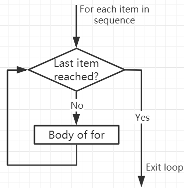

.. note::

    Hello, welcome to the SunFounder Raspberry Pi & Arduino & ESP32 Enthusiasts Community on Facebook! Dive deeper into Raspberry Pi, Arduino, and ESP32 with fellow enthusiasts.

    **Why Join?**

    - **Expert Support**: Solve post-sale issues and technical challenges with help from our community and team.
    - **Learn & Share**: Exchange tips and tutorials to enhance your skills.
    - **Exclusive Previews**: Get early access to new product announcements and sneak peeks.
    - **Special Discounts**: Enjoy exclusive discounts on our newest products.
    - **Festive Promotions and Giveaways**: Take part in giveaways and holiday promotions.

    👉 Ready to explore and create with us? Click [|link_sf_facebook|] and join today!

.. _syntax_forloop:

For Loops
============

The ``for`` loop can traverse any sequence of items, such as a list or a string.

The syntax format of for loop is as follows:

.. code-block:: python

    for val in sequence:
        Body of for

Here, ``val`` is a variable that gets the value of the item in the sequence in each iteration.

The loop continues until we reach the last item in the sequence. Use indentation to separate the body of the ``for`` loop from the rest of the code.

**Flowchart of for Loop**

.. code-block:: python

    numbers = [1, 2, 3, 4]
    sum = 0

    for val in numbers:
        sum = sum+val
        
    print("The sum is", sum)

>>> %Run -c $EDITOR_CONTENT
The sum is 10

The break Statement
-------------------------

With the break statement we can stop the loop before it has looped through all the items:

.. code-block:: python

    numbers = [1, 2, 3, 4]
    sum = 0

    for val in numbers:
        sum = sum+val
        if sum == 6:
            break
    print("The sum is", sum)

>>> %Run -c $EDITOR_CONTENT
The sum is 6

The continue Statement
--------------------------------------------

With the ``continue`` statement we can stop the current iteration of the loop, and continue with the next:

.. code-block:: python

    numbers = [1, 2, 3, 4]

    for val in numbers:
        if val == 3:
            continue
        print(val)

>>> %Run -c $EDITOR_CONTENT
1
2
4

The range() function
--------------------------------------------

We can use the range() function to generate a sequence of numbers. range(6) will produce numbers between 0 and 5 (6 numbers).

We can also define start, stop and step size as range(start, stop, step_size). If not provided, step_size defaults to 1.

In a sense of range, the object is "lazy" because when we create the object, it does not generate every number it "contains". However, this is not an iterator because it supports in, len and ``__getitem__`` operations.

This function will not store all values ​​in memory; it will be inefficient. So it will remember the start, stop, step size and generate the next number during the journey.

To force this function to output all items, we can use the function list().

.. code-block:: python

    print(range(6))

    print(list(range(6)))

    print(list(range(2, 6)))

    print(list(range(2, 10, 2)))

>>> %Run -c $EDITOR_CONTENT
range(0, 6)
[0, 1, 2, 3, 4, 5]
[2, 3, 4, 5]
[2, 4, 6, 8]

We can use ``range()`` in a ``for`` loop to iterate over a sequence of numbers. It can be combined with the len() function to use the index to traverse the sequence.

.. code-block:: python

    fruits = ['pear', 'apple', 'grape']

    for i in range(len(fruits)):
        print("I like", fruits[i])
        
>>> %Run -c $EDITOR_CONTENT
I like pear
I like apple
I like grape

Else in For Loop
--------------------------------

The ``for`` loop can also have an optional ``else`` block. If the items in the sequence used for the loop are exhausted, the ``else`` part is executed.

The ``break`` keyword can be used to stop the ``for`` loop. In this case, the ``else`` part will be ignored.

Therefore, if no interruption occurs, the ``else`` part of the ``for`` loop will run.

.. code-block:: python

    for val in range(5):
        print(val)
    else:
        print("Finished")

>>> %Run -c $EDITOR_CONTENT
0
1
2
3
4
Finished

The else block will NOT be executed if the loop is stopped by a break statement.

.. code-block:: python

    for val in range(5):
        if val == 2: break
        print(val)
    else:
        print("Finished")

>>> %Run -c $EDITOR_CONTENT
0
1

