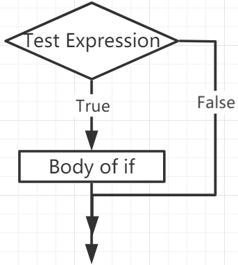
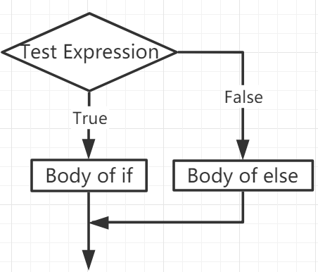
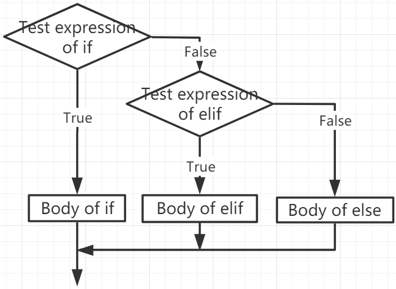

If Else
=============

Decision making is required when we want to execute a code only if a certain condition is satisfied.

if
--------------------
.. code-block:: python

    if test expression:
        statement(s)

Here, the program evaluates the ``test expression`` and executes the ``statement`` only when the ``test expression`` is True.

If ``test expression`` is False, then ``statement(s)`` will not be executed.

In MicroPython, indentation means the body of the ``if`` statement. The body starts with an indentation and ends with the first unindented line.

Python interprets non-zero values ​​as "True". None and 0 are interpreted as "False".

**if Statement Flowchart**

**Example**

.. code-block:: python

    num = 8
    if num > 0:
        print(num, "is a positive number.")
    print("End with this line")

>>> %Run -c $EDITOR_CONTENT
8 is a positive number.
End with this line

if...else
-----------------------

.. code-block:: python

    if test expression:
        Body of if
    else:
        Body of else

The ``if..else`` statement evaluates ``test expression`` and will execute the body of ``if`` only when the test condition is ``True``.

If the condition is ``False``, the body of ``else`` is executed. Indentation is used to separate the blocks.

**if...else Statement Flowchart**

**Example**

.. code-block:: python

    num = -8
    if num > 0:
        print(num, "is a positive number.")
    else:
        print(num, "is a negative number.")

>>> %Run -c $EDITOR_CONTENT
-8 is a negative number.

if...elif...else
--------------------

.. code-block:: python

    if test expression:
        Body of if
    elif test expression:
        Body of elif
    else: 
        Body of else

``Elif`` is short for ``else if``. It allows us to check multiple expressions.

If the condition of the ``if`` is False, the condition of the next elif block is checked, and so on.

If all conditions are ``False``, the body of ``else`` is executed.

Only one of several ``if...elif...else`` blocks is executed according to the conditions.

The ``if`` block can only have one ``else`` block. But it can have multiple ``elif`` blocks.

**if...elif...else Statement Flowchart**

**Example**

.. code-block:: python

    x = 10
    y = 9

    if x > y:
        print("x is greater than y")
    elif x == y:
        print("x and y are equal")
    else:
        print("x is greater than y")

>>> %Run -c $EDITOR_CONTENT
x is greater than y

Nested if
---------------------

We can embed an if statement into another if statement, and then call it a nested if statement.

**Example**

.. code-block:: python

    x = 67

    if x > 10:
        print("Above ten,")
        if x > 20:
            print("and also above 20!")
        else:
            print("but not above 20.")

>>> %Run -c $EDITOR_CONTENT
Above ten,
and also above 20!