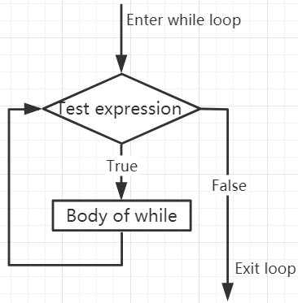

.. note::

    Bonjour, bienvenue dans la communauté des passionnés de SunFounder Raspberry Pi, Arduino et ESP32 sur Facebook ! Plongez plus profondément dans le monde des Raspberry Pi, Arduino et ESP32 avec d'autres passionnés.

    **Pourquoi nous rejoindre ?**

    - **Support d'experts** : Résolvez les problèmes post-achat et les défis techniques avec l'aide de notre communauté et de notre équipe.
    - **Apprendre et partager** : Échangez des astuces et des tutoriels pour améliorer vos compétences.
    - **Avant-premières exclusives** : Bénéficiez d'un accès anticipé aux annonces de nouveaux produits et aux avant-premières.
    - **Réductions spéciales** : Profitez de réductions exclusives sur nos derniers produits.
    - **Promotions festives et concours** : Participez à des concours et promotions spéciales durant les fêtes.

    👉 Prêt à explorer et créer avec nous ? Cliquez sur [|link_sf_facebook|] et rejoignez-nous dès aujourd'hui !

.. _py_syntax_while:

Boucles While
====================

L'instruction ``while`` est utilisée pour exécuter un programme en boucle, c'est-à-dire pour répéter une tâche tant qu'une certaine condition est remplie, permettant de traiter des actions récurrentes.

Sa forme de base est :

.. code-block:: python

    while test expression:
        Body of while

Dans la boucle ``while``, l'``expression de test`` est d'abord vérifiée. Seulement si l'``expression de test`` est évaluée à ``True``, on entre dans le corps de la boucle. Après chaque itération, l'``expression de test`` est vérifiée à nouveau. Ce processus continue jusqu'à ce que l'``expression de test`` devienne ``False``.

En MicroPython, le corps de la boucle ``while`` est défini par l'indentation.

Le corps commence avec une indentation et se termine à la première ligne non indentée.

Python interprète toute valeur non nulle comme ``True``. None et 0 sont interprétés comme ``False``.

**Organigramme de la boucle while**

.. code-block:: python

    x = 10

    while x > 0:
        print(x)
        x -= 1

>>> %Run -c $EDITOR_CONTENT
10
9
8
7
6
5
4
3
2
1

Instruction Break
-----------------------

Avec l'instruction break, nous pouvons arrêter la boucle même si la condition du while est vraie :

.. code-block:: python

    x = 10

    while x > 0:
        print(x)
        if x == 6:
            break
        x -= 1

>>> %Run -c $EDITOR_CONTENT
10
9
8
7
6

Boucle While avec Else
---------------------------
Comme avec la boucle ``if``, la boucle ``while`` peut également avoir un bloc ``else`` optionnel.

Si la condition dans la boucle ``while`` est évaluée à ``False``, la partie ``else`` est exécutée.

.. code-block:: python

    x = 10

    while x > 0:
        print(x)
        x -= 1
    else:
        print("Game Over")

>>> %Run -c $EDITOR_CONTENT
10
9
8
7
6
5
4
3
2
1
Game Over