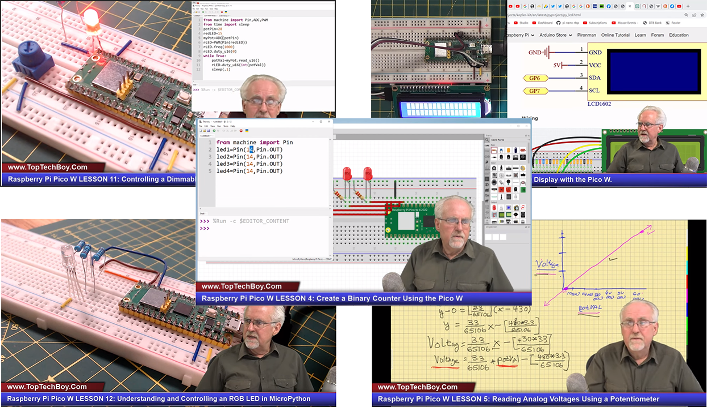

ビデオコース
========================

オンラインドキュメントの内容が少し難解に感じる場合、心配無用です。
ステップバイステップのビデオコースが、よりスムーズで楽しい学習経験を提供します。

ビデオコースには、以下のリンクでアクセスできます：|link_paul_course| 。

このビデオシリーズは、Raspberry Pi Pico Wに特化しており、MicroPythonの基本から各コンポーネントの働き、さらには関連する電子回路の知識までを網羅しています。
各ビデオは、視聴者が積極的に参加できるように、教育的かつエンターテイニングに設計されています。
このビデオコースに没頭し、実践的なアクティビティに参加することで、Raspberry Pi Pico Wの学習がより豊かで楽しいものに変わります。

